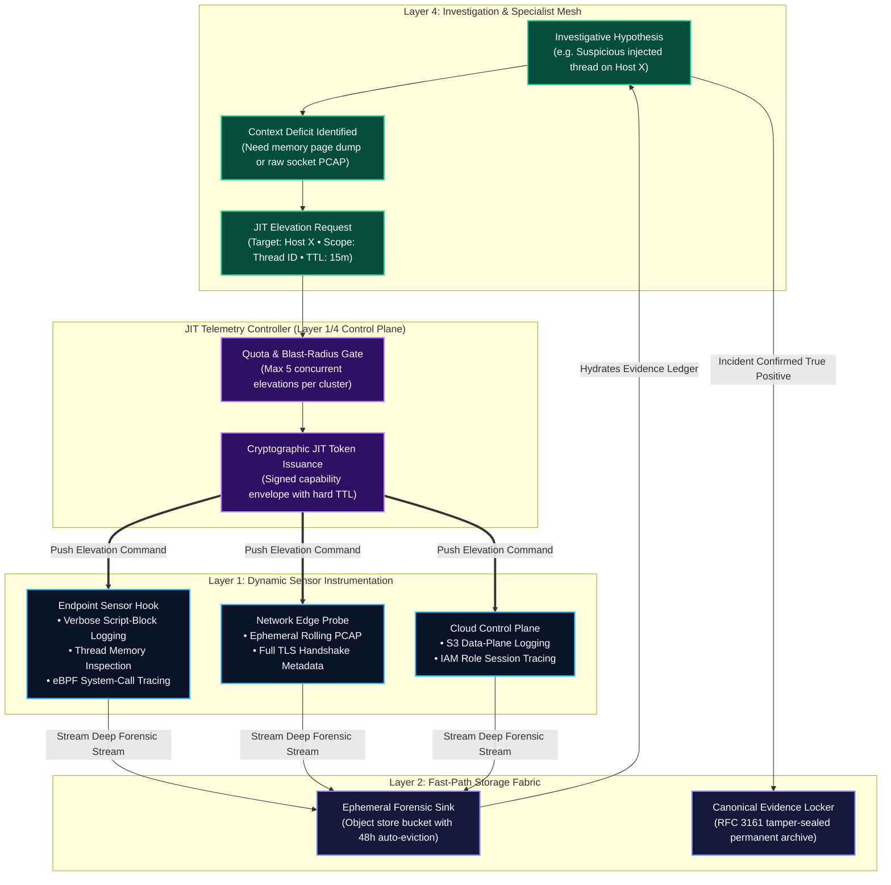

# 0016. Just-in-Time (JIT) Telemetry Elevation and Ephemeral Forensic Envelopes

* Status: accepted
* Deciders: Architecture Team / Harry
* Date: 2026-09-16

Technical Story: [On-Demand Forensic Elevation & Ephemeral Deep Context]

## Context and Problem Statement

Modern enterprise security operations face an acute economic and operational dilemma regarding telemetry collection depth:

1. **The Continuous Full-Fidelity Collection Paradox**: Enterprises cannot afford to execute deep forensic instrumentation 24/7 across tens of thousands of endpoints, containers, and cloud resources. Continuous kernel system-call tracing (eBPF), full memory page dumps, verbose script-block logging, and rolling packet captures (PCAP) generate petabytes of high-entropy noise daily, overwhelming network links, saturating disk I/O, and causing catastrophic storage cost inflation.
2. **The Investigation Information Starvation Deficit**: Conversely, baseline security monitoring relies on summarized, low-overhead event streams (e.g. process start/stop, network flow 5-tuples). When an anomalous detection or partial attack hypothesis arises in Layer 4 (e.g., an encoded command on a developer workstation or an atypical outbound TLS handshake from an API gateway), investigating analysts and autonomous specialist agents hit an **evidentiary dead end**: *the exact contextual details needed to confirm or falsify root-cause intrusion (e.g. process memory strings, decrypted payload bytes, or child thread injections) were never collected.*

How does TIDIR provide surgical, on-demand deep forensic visibility during active investigations and incident response without imposing 24/7 storage and performance penalties across the enterprise?

## Decision Drivers

* **Surgical Deep Visibility:** The ability to dynamically command sensors, host agents, and network taps to generate granular, deep-dive telemetry for specific investigative requirements.
* **Bounded Ephemerality & Automated Rollback:** Ensuring that deep collection modes are strictly time-bounded (enforced TTLs) and automatically revert to baseline overhead without human operational intervention.
* **Storage Cost Insulation:** Isolating high-volume ephemeral forensic data from canonical long-term lakehouse tables, enforcing rapid automated data lifecycle eviction.
* **Agentic Programmability with Safety Quotas:** Exposing structured tool contracts that allow autonomous specialist agents (Host, Network, Cloud) to request elevation orders within strict concurrency and resource bounds.

## Considered Options

1. **Static 24/7 Deep Collection:** Configure all enterprise agents to permanently emit maximum-fidelity telemetry across all endpoints and network interfaces.
2. **Manual Ad-Hoc Forensic SSH/Remote Access:** Require human responders to manually remote-desktop or SSH into suspect hosts with live triage CLI tools upon alert escalation.
3. **Just-in-Time (JIT) Telemetry Elevation with Ephemeral Forensic Envelopes (Selected):** Implement an event-driven control plane where Layer 4 investigators and agents issue signed, cryptographically verified **JIT Telemetry Elevation Orders** that temporarily reconfigure edge sensors for bounded time windows ($\Delta t = 15\text{m} \dots 30\text{m}$), routing raw forensic artifacts into ephemeral auto-evicting storage sinks.

## Decision Outcome

Chosen option: **Just-in-Time (JIT) Telemetry Elevation with Ephemeral Forensic Envelopes**, structured across four operational mechanisms:

---

### 1. The Closed-Loop JIT Elevation Pipeline

When an investigator or autonomous specialist subagent in Layer 4 identifies a hypothesis gap that cannot be resolved using existing Lakehouse context, the orchestrator triggers a closed-loop elevation cycle:

---

### 2. Modality & Scope of JIT Elevation Modes

JIT elevation orders apply surgical, targeted instrumentation rather than broad collection sweeps:

| Domain | Baseline Telemetry (24/7) | JIT Elevated Telemetry (TTL $\le 30\text{ min}$) | Triggering Specialist Agent |
| :--- | :--- | :--- | :--- |
| **Endpoint (Host)** | Process execution start/stop, user logins, basic file creates. | Full PowerShell/bash Script Block logging, kernel syscall hooks (eBPF), process memory page string dumps, loaded DLL verification. | Host Forensic Subagent (`mcp-host-forensics`) |
| **Network** | Flow 5-tuples (IP/port/proto), bytes transferred, NetFlow. | Ephemeral rolling wire-level PCAP (bounded to target IP/port), full TLS certificate chains, HTTP header traces. | Network Subagent (`mcp-network-investigator`) |
| **Identity & SaaS** | Standard SSO authentication success/failure. | Verbose token refresh eventing, tenant conditional access debug traces, directory attribute mutation audits. | Identity Subagent (`mcp-identity-scoper`) |
| **Cloud Infrastructure** | Management plane audit logs (AWS CloudTrail management). | Data plane access logging (S3 object GetObject/PutObject, KMS Decrypt calls, VPC DNS resolution streams). | Cloud Subagent (`mcp-cloud-investigator`) |

---

### 3. Strict Ephemerality & Hard TTL Invariants

To guarantee that deep collection never permanently degrades host performance or creates runaway cloud bills:

1. **Hardware-Enforced Time-to-Live (TTL)**:
   - Every JIT elevation token carries an absolute UTC expiration timestamp ($\text{TTL} \le 30\text{ minutes}$).
   - Edge sensors enforce the TTL autonomously at the local agent level. Even if the network connection between the central orchestrator and the host drops, the local sensor automatically terminates elevated collection and reverts to baseline upon TTL expiration.
2. **Quota Ceilings & Blast-Radius Budgeting**:
   - The JIT Controller enforces hard cluster-wide concurrency limits: no more than 5 concurrent endpoints or 2 network interfaces per enterprise subnet may be elevated simultaneously.
   - Host CPU/memory ceilings for elevated hooks are capped at $< 10\%$ CPU and 512MB RAM with automatic circuit breaker termination if host workload latency degrades.

---

### 4. Ephemeral Forensic Sinks & Zero Canonical Pollution

Deep forensic streams generated by JIT elevation bypass standard 365-day Lakehouse tables to avoid metadata thrashing and storage bloat:

- **Isolated Storage Sink**: JIT streams land in dedicated ephemeral object storage buckets (`s3://tidir-forensic-ephemeral/<case-id>/`).
- **48-Hour Auto-Eviction Lifecycle**: Data in the ephemeral sink is configured with an aggressive lifecycle policy that hard-deletes objects after 48 hours.
- **Selective Promotion to Evidence Locker**: If the elevated context confirms an active incident (True Positive), the specific forensic artifacts (e.g. the memory dump slice or extracted PCAP) are atomically copied into the **Tamper-Evident Evidence Locker** (`INV-04`), sealed with SHA-256 hash chains and RFC 3161 timestamps. If the investigation concludes the activity was benign, the data is allowed to silently expire at $0.00 multi-year storage cost.

---

## Pros and Cons of the Options

### Option 1: Static 24/7 Deep Collection

* Good, because historical data is always present without waiting for elevation orders.
* Bad, because storage, ingest compute, and network bandwidth costs scale catastrophically by $10\times$–$50\times$.
* Bad, because running continuous deep kernel hooks degrades performance across business-critical endpoints and servers.

### Option 2: Manual Ad-Hoc Forensic SSH/Remote Access

* Good, because it requires no specialized dynamic sensor controller infrastructure.
* Bad, because it depends on slow human response times (45–120 minutes), failing to contain fast-moving attacks.
* Bad, because remote terminal logins alter host state, destroy volatile memory artifacts, and lack structured auditability.

### Option 3: JIT Telemetry Elevation with Ephemeral Forensic Envelopes (Selected)

* Good, because it delivers deep forensic visibility precisely when and where it is needed to resolve investigative hypotheses.
* Good, because strict TTLs and auto-evicting storage sinks keep compute and storage budgets lean and predictable.
* Good, because autonomous agents can systematically scope incidents without human operational friction.
* Bad, because ephemeral collection cannot recover artifacts that occurred *prior* to the elevation command (mitigated by localized circular edge ring buffers).
* Bad, because dynamic sensor re-instrumentation introduces API dependencies between Layer 4 controllers and Layer 1 edge collectors.

---

## Consequences

### Positive Consequences

* Slashes Mean Time to Investigate (MTTI) by enabling instant, programmatically summoned deep context.
* Protects enterprise budgets by restricting petabyte-scale forensic capture to surgical, short-term windows.
* Keeps the primary 365-day Lakehouse clean and optimized for long-term analytical baselining.

### Negative Consequences

* Requires edge agents and network sensors to support dynamic runtime re-instrumentation via authenticated control APIs.
* Adversaries who terminate their malicious actions before the JIT elevation order executes may avoid deep capture (mitigated by localized circular memory ring buffers).
