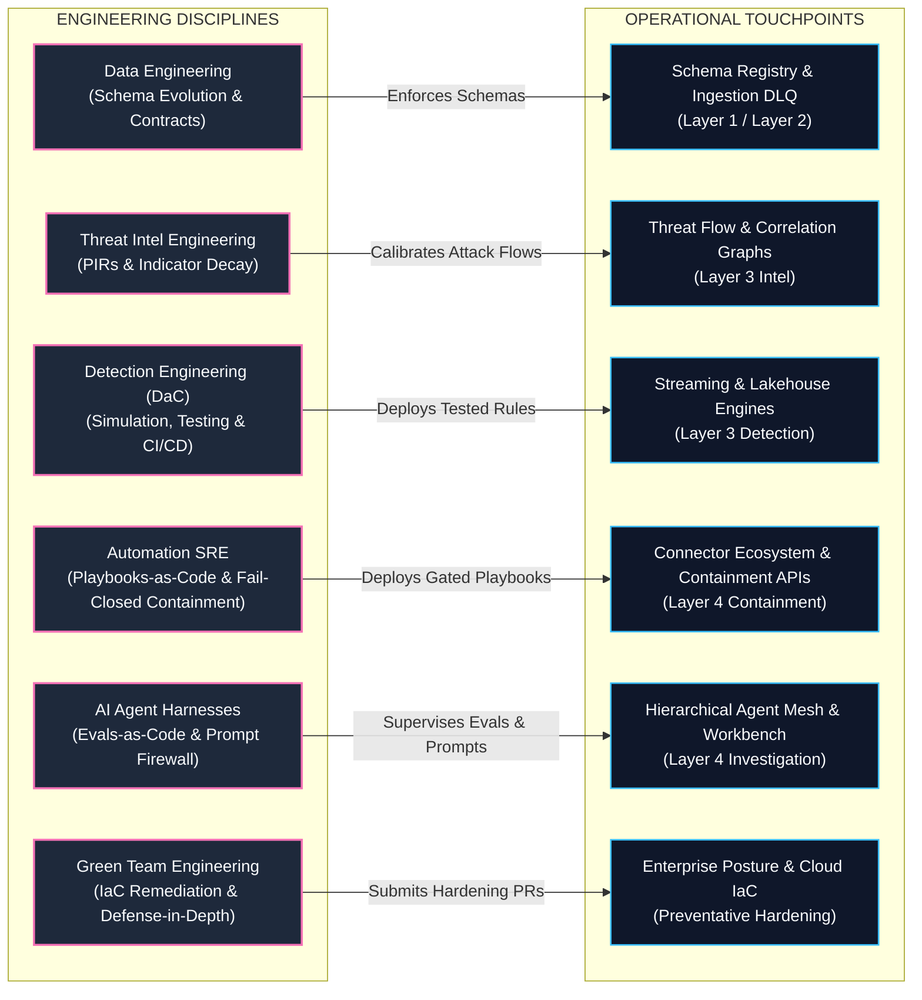

# TIDIR Target System Architecture

This document defines the target component architecture for the unified **Threat Intelligence, Detection, Investigation & Response (TIDIR)** platform.

---

## 1. System Topology Diagram

The architecture operates across two orthogonal dimensions:
1. **The Operational Runtime Plane**: Four horizontal layers governing event ingestion, computation, detection, and mitigation.
2. **The Engineering Lifecycle Plane**: Five vertical disciplines governing schemas, intelligence curation, Detection-as-Code (DaC), systems automation, and AI harnesses.

### 1.1 Operational Runtime Pipeline

The operational pipeline processes security events in a strict directional flow from point-of-origin generation to automated mitigation, with an outer perimeter feedback channel for attributed threat intelligence and visibility calibration:

```mermaid
flowchart TB
  %% Styling Classes
  classDef layer1 fill:#0b1329,stroke:#38bdf8,stroke-width:2px,color:#f8fafc;
  classDef layer2 fill:#16193b,stroke:#818cf8,stroke-width:2px,color:#f8fafc;
  classDef layer3 fill:#24123f,stroke:#c084fc,stroke-width:2px,color:#f8fafc;
  classDef layer4 fill:#06372b,stroke:#34d399,stroke-width:2px,color:#f8fafc;

  %% Layer 1: Data Sources & Environmental Inputs
  subgraph L1 ["LAYER 1: DATA SOURCES & CONTEXTUAL INGESTION"]
    L1_LOGS["Machine-Readable Logs & OS Events\n(Syslog RFC 5424, JSON/NDJSON, Windows EVTX, journald, cloud audit)"]:::layer1
    L1_TELEM["Runtime Operational Telemetry\n(Kernel hooks, eBPF, audit trails, network flows & identity)"]:::layer1
    L1_CTX["Enterprise Posture & Asset Context\n(CMDB hierarchy, attack surface exposure, control status)"]:::layer1
    L1_CTI["Cyber Threat Intelligence (CTI)\n(STIX 2.1 tactical feeds, CVE weaponization, threat actors)"]:::layer1
  end

  %% Layer 2: Pipeline, Storage & Query Fabric
  subgraph L2 ["LAYER 2: PIPELINE, STORAGE & QUERY FABRIC"]
    L2_INGEST["Line-Rate Ingestion & OCSF Normalization\n(Schema registry, unmapped data catch-all & DLQ)"]:::layer2
    L2_ROUTER["Value-Based Tiering & Stream Router\n(Tier A hot stream, Tier B lakehouse, Tier C filter)"]:::layer2
    L2_STORAGE["Multi-Paradigm Storage & Query Core\n(Hot index, columnar lakehouse, two-tier sketch state Δt)"]:::layer2
  end

  %% Layer 3: Threat Intelligence & Detection Engineering
  subgraph L3 ["LAYER 3: THREAT INTEL & DETECTION ENGINEERING"]
    L3_FLOW["Machine-Readable Threat Models\n(Adversary attack flows, PIRs, graph mapping)"]:::layer3
    L3_DAC["Dual-Lane DaC Engine\n(Fast-lane emergency zero-day + standard 30d lakehouse)"]:::layer3
    L3_RISK["Risk Lens & Finding Synthesis\n(Supernode-dampened graph clustering, OCSF 2001/2004)"]:::layer3
  end

  %% Layer 4: Incident Response & Automation
  subgraph L4 ["LAYER 4: INVESTIGATION, CASE MANAGEMENT & AUTOMATED RESPONSE"]
    L4_DOSSIER["Unified Investigation & Case Dossier\n(Entity 360, progressive disclosure UX, sealed timeline)"]:::layer4
    L4_TRIAGE["Hierarchical Agent Mesh & JIT Elevation\n(Lead orchestrator, host/network/cloud specialists, JIT orders)"]:::layer4
    L4_RESP["Asymmetric Fail-Secure Containment\n(Forward escalation, dual-auth gates, break-glass override)"]:::layer4
  end

  %% Closed-Loop Architectural Feedback
  subgraph FB ["CLOSED-LOOP CONTINUOUS CALIBRATION"]
    FB_INTEL["Attributed Threat Flows & IOCs\n(Re-ingested into L1 CTI & L3 Detection Backlog)"]
    FB_GAPS["Telemetry Blindspot Analysis\n(Re-tunes L1 Sensor Filters & Collection Audits)"]
    FB_JIT["JIT Telemetry Elevation Orders\n(Dynamically re-instruments L1 edge sensors for 15-30m)"]
    FB_RESP["Playbook Execution Efficacy\n(Refines L4 Blast-Radius & Forward Models)"]
    FB_GREEN["Green Team Prevention Triggers\n(IaC Pull Requests & Defense-in-Depth Hardening)"]
  end

  %% Operational Progression (Strict Top-to-Bottom DAG)
  L1 ==>|1. Transport Envelopes & Raw Ingestion| L2
  L2 ==>|2. Normalized Telemetry & Low-Latency State Δt| L3
  L3 ==>|3. Correlated Security & Detection Findings| L4
  L4 ==>|4. Incident Dossiers & Post-Mortem Outcomes| FB
```

### 1.2 Engineering Lifecycle & Closed-Loop Governance Plane

The engineering plane governs the operational pipeline through version-controlled specifications, declarative policy engines, and automated validation gates:

---

## 2. Layer Definitions & Operational Responsibilities

### Layer 1: Data Sources & Environmental Inputs
- **Generation, Collection & Transport**: Emits raw facts at the point of origin across standard machine-readable logs (Syslog RFC 5424, JSON/NDJSON, Windows EVTX, journald, cloud audit trails), kernel hooks (eBPF, ETW), control plane APIs, and wire taps, buffering at the edge and transporting across network boundaries via secure, compressed streams.
- **Multidimensional Inputs**: Unifies standard machine-readable logs and runtime operational telemetry with external cyber threat intelligence (CTI), organizational context (asset CMDB, directory hierarchies), attack surface exposure (EASM), and security control posture.
- See full spec: [Layer 1 Specification](03-layer-1-data-sources.md).

### Layer 2: Pipeline, Storage & Query Fabric
- **Line-Rate Normalization**: Standardises raw payloads into Open Cybersecurity Schema Framework (OCSF) objects via an authoritative Schema Registry.
- **Value-Based Routing**: Diverts high-value security events to hot indexing and stream engines while streaming bulk forensic telemetry into low-cost columnar lakehouse storage.
- **Multi-Paradigm Querying**: Provides four specialized engines: Real-Time Streaming (< 5s), Scheduled Batch SQL (7–90 day baselines), Federated Query-in-Place, and ML Feature Stores.
- See full spec: [Layer 2 Specification](04-layer-2-pipeline-storage-query.md).

### Layer 3: Threat Intelligence & Detection Engineering
- **Dual-Lane Detection Ingress**: Balances a probabilistic, Bayesian compounding lane for correlated weak signals with a deterministic fast-path that immediately elevates zero-tolerance invariants (canary tokens, BYOVD kernel tampering) without graph delay.
- **Machine-Readable Attack Flows**: Codifies multi-stage adversary behaviours into structured graphs, prioritising detection engineering backlogs via threat likelihood and asset exposure.
- **Detection-as-Code (DaC)**: All rules are authored as declarative code using a Polyglot DaC pattern (vendor-neutral YAML metadata envelopes coupled with target-optimized query blocks, see [ADR-0019](../adr/0019-polyglot-detection-as-code-and-native-engine-adaptation.md)), versioned in Git.
- **Empirical Test Harness**: Validates rules through controlled adversary simulation, synthetic unit tests, and 30-day historical lakehouse backtesting.
- **Standardised Findings**: Emits OCSF Class 2001 (Security Finding) and Class 2004 (Detection Finding) objects.
- See full spec: [Layer 3 Specification](06-layer-3-threat-intel-detection.md).

### Layer 4: Incident Response (Investigation, Case Management & Automated Containment)
- **Progressive Disclosure Workbench**: Presents a 3-tier cognitive hierarchy (Situation Summary ➔ Forensic Evidence Table ➔ On-Demand Graph Lineage) to achieve sub-60-second analyst comprehension without visual fatigue.
- **Hierarchical Agent Mesh**: Dispatches specialized autonomous subagents (host forensic, identity, network, cloud) coordinated by a Lead Triage Orchestrator behind an isolated **Prompt Injection Firewall**, governed by asymmetric consensus arbitration.
- **Tamper-Evident Evidence Dossier**: Records queries, annotations, and artifacts with cryptographic integrity (RFC 3161 timestamps) for post-incident review.
- **Monotonic Fail-Closed Containment**: Executes containment as monotonic state machines that never regress or roll back previously applied isolation barriers (see [ADR-0005](../adr/0005-saga-pattern-containment-and-break-glass-protocol.md)), separating low-risk actions (Tier 1) from disruptive actions (Tier 2) governed by dual-authorisation consensus and an audited **Break-Glass Emergency Protocol**.
- **Closed-Loop Feedback & Green Team Prevention**: While TIDIR intentionally scopes its core engine to threat intelligence, detection, investigation, and incident response (deliberately avoiding duplicating inline prevention appliances), it completes the closed loop by programmatically recommending and triggering **Green Teams** (infrastructure, platform, and cloud security engineering). Post-incident findings, exploited misconfigurations, and lateral movement paths automatically synthesize Infrastructure-as-Code (IaC) pull requests, identity boundary tightenings, and preventative control improvements to permanently eradicate root causes and deepen enterprise defense-in-depth.
- See full spec: [Layer 4 Specification](07-layer-4-incident-response.md) and [AI & Agentic Orchestration Plane](components/06-ai-orchestration.md).

---

## 3. Data Contracts Across the Architecture

| Boundary | Schema Contract | Purpose |
| :--- | :--- | :--- |
| **L1 ➔ L2 Ingress** | Native / Schema Registry Envelope | Bounded transport batch carrying origin metadata and raw event facts. |
| **L2 Normalization** | OCSF (Open Cybersecurity Schema Framework) | Canonical schema across system, identity, network, cloud, and application domains. |
| **L3 Detection Target** | OCSF Classes (1001, 1007, 3002, 4001, etc.) & Target Dialects | Vendor-neutral governance metadata envelope with target-optimized query blocks (KQL, SPL, SQL). |
| **L3 ➔ L4 Handoff** | OCSF Class 2001 & Class 2004 Findings | Standardised security and detection findings carrying evidence, ATT&CK tags, and risk scores. |
| **L4 Agent Tool Contract** | Model Context Protocol (MCP) & Typed JSON Schema | Parameters for read-only forensic queries; strictly isolates prompts from unformatted raw telemetry. |
| **L4 Monotonic Containment** | Asymmetric Action Specifications | Parameterized forward action ($T_i$) and forward escalation payloads; strictly fail-closed with zero containment rollback. |

---

## 4. The Executive AI & Autonomous Agentic Opportunity Matrix (The CISO Lens)

For executive cybersecurity leaders (CISOs and SecOps Directors), integrating Artificial Intelligence into security operations carries dual imperatives: **maximizing defensive velocity while enforcing deterministic safety boundaries**. 

TIDIR establishes an **AI-First Defence Architecture** that moves beyond single-prompt helpers to an orchestrated agent mesh, while anchoring execution, schema contracts, and disruptive containment behind deterministic engineering gates and evals.

| Architectural Layer | Autonomous AI / Agent Opportunity | Deterministic Safety Gate | Strategic CISO ROI & Business Value |
| :--- | :--- | :--- | :--- |
| **Layer 1: Data Sources & Ingress** | **Automated Log Parser Synthesis**: Generative models analyze unmapped vendor logs and draft canonical OCSF mapping parsers. | **Schema Registry Validation**: Parsers cannot deploy without passing compiler type-checking and automated regression replay. | **85% Faster Source Onboarding**: Eliminates weeks of manual log ingestion engineering for proprietary enterprise tools. |
| **Layer 1: Data Sources & Ingress** | **Synthetic Telemetry Generation**: Generates high-fidelity attack telemetry for dangerous, untestable techniques (e.g. ransomware encryption loops). | **Isolated Test Sandbox**: Generated telemetry executes strictly within non-production environments. | **Zero-Risk Efficacy Testing**: Validates detection sensors against catastrophic exploits without running malware on live systems. |
| **Layer 2: Pipeline & Storage Fabric** | **Natural Language Data Exploration**: Translates plain-language analyst questions into optimised SQL/streaming queries. | **Read-Only AST Validator**: Enforces strict SELECT-only query constraints and compute timeout budgets. | **3x Analyst Query Velocity**: Junior analysts conduct complex multi-table lakehouse investigations without learning complex query dialects. |
| **Layer 3: Detection Engineering** | **Threat Advisory to Attack Flow Synthesis**: Ingests unstructured CTI advisories and bulletins and extracts structured ATT&CK DAG flows. | **Human CTI Peer Review**: Analyst ratifies extracted Priority Intelligence Requirements (PIRs). | **10x Faster Threat Codification**: Reduces the window between zero-day public disclosure and detection backlog prioritisation from days to minutes. |
| **Layer 3: Detection Engineering** | **Continuous Evals-as-Code & DaC Quality Judge**: Multi-agent judges and CI benchmark suites audit detection rules and agent prompts against golden incident datasets. | **CI/CD Unit & Regression Suite**: Rules and agent prompts must achieve 100% pass rate on synthetic fixtures and 30-day lakehouse backtests. | **Eliminates Production Alert Thrashing**: Prevents brittle, performance-degrading detection rules and drifting agent prompts from reaching production. |
| **Layer 4: Investigation & Cases** | **Hierarchical Agent Mesh (Host/Identity/Network)**: Lead orchestrator dispatches specialist subagents to scope 90-day baselines, process lineages, and lateral movement simultaneously. | **Prompt Injection Firewall & Dual-Plane Isolation**: Telemetry strings are treated as untrusted data planes; agents invoke typed tools without executing raw string commands. | **75% Reduction in Pivot Fatigue**: Tier-1 analysts receive a fully hydrated case dossier containing complete process lineage and host context upon initial ticket open. |
| **Layer 4: Incident Response (Automated Containment)** | **Pre-Execution Blast-Radius Simulator & Containment Engine**: Evaluates active network connections, service criticality, and dependency trees; executes monotonic forward containment with forward escalation on error. | **Dual-Authorisation Consensus & Audited Break-Glass**: Tier 2 containment requires multi-signature approval; high-velocity outbreaks support single-commander break-glass with cryptographic broadcast. | **Mitigates Inadvertent Outages**: Eliminates the risk of false-positive agent recommendations isolating critical revenue-generating infrastructure. |

---

## 5. The Detection Engineer's Operational Walkthrough (The Practitioner Lens)

To understand how the TIDIR architecture functions in day-to-day cyber defence, consider how a **Detection Engineer** navigates the lifecycle from a novel threat advisory to a hardened, deployed detection rule:

```mermaid
flowchart LR
  %% Practitioner Steps
  classDef step fill:#0f172a,stroke:#38bdf8,stroke-width:2px,color:#f8fafc;
  classDef gate fill:#2e1065,stroke:#c084fc,stroke-width:2px,color:#f8fafc;
  classDef prod fill:#064e3b,stroke:#34d399,stroke-width:2px,color:#f8fafc;

  S1["1. Threat Advisory\n(Novel Attack Technique)"]:::step
  S2["2. Machine-Readable Flow\n(Layer 3 ATT&CK DAG)"]:::step
  S3["3. DaC Rule Authoring\n(Targets OCSF Class 1007)"]:::step
  S4["4. CI/CD Simulation Gate\n(Synthetic unit & 30d backtest)"]:::gate
  S5["5. Production Deployment\n(Streaming <5s & Lakehouse SQL)"]:::prod
  S6["6. Correlated Dossier\n(Risk Lens clusters findings)"]:::prod

  S1 --> S2 --> S3 --> S4 --> S5 --> S6
```

### Step-by-Step Practitioner Journey

1. **Adversary Technique Published**: A threat intelligence alert details a novel DLL Search Order Hijacking technique (*MITRE ATT&CK T1574.002*).
2. **Attack Flow Ingestion**: In **Layer 3**, the intelligence engine parses the advisory into a machine-readable attack flow detailing the prerequisite process execution events, file creations, and command-line arguments.
3. **Telemetry Verification (Layer 1)**: The Detection Engineer confirms that enterprise endpoints emit the required telemetry—verifying that Windows Event Log Channel `Microsoft-Windows-Sysmon/Operational` (Event ID 7: Image Load) and Linux eBPF module loads are actively ingested and mapped to **OCSF Class 1007 (Process Activity)**. Any non-standard fields are verified in `unmapped_data`.
4. **Declarative Rule Authoring (DaC)**: In the Detection-as-Code repository, the engineer authors a Polyglot DaC rule: defining the vendor-neutral metadata envelope targeting OCSF Class 1007 attributes, paired with target-optimized query blocks (e.g., KQL, SPL, and Lakehouse SQL) for production execution.
5. **Automated CI/CD Validation**: Upon opening a Git Pull Request:
   - *Synthetic Unit Tests*: Run mock OCSF payloads through the rule parser to verify true-positive trigger conditions and benign edge-case pass-through.
   - *30-Day Historical Backtest*: The CI pipeline queries a 30-day lakehouse sample in `pre-prod` to calculate the **Expected Alert Volume (EAV)** and ensure the false-positive rate falls within error budgets.
   - *LLM Quality Judge*: An automated harness audits the rule for schema field deprecations and ensures triage guidance is complete.
6. **Deployment & Execution (Layer 2 & 3)**: Once merged to `main`, GitOps automations deploy the rule to the **Streaming Engine** (for sub-5-second alerting on interactive sessions) and the **Lakehouse Batch Engine** (for 24-hour baseline sweeps).
7. **Risk-Lens Correlation & Incident Elevation (Layer 3 ➔ Layer 4)**: If the rule fires in production, the alert is not thrown into an unmanaged ticket queue. Layer 3's graph correlation engine links the event with network connections and user authentication events, computes the composite risk score, and elevates a structured **Incident Dossier** directly to the Tier-1 operator workbench.

