# TIDIR Target System Architecture

This document defines the target component architecture for the unified **Threat Intelligence, Detection, Investigation & Response (TIDIR)** platform.

---

## 1. System Topology Diagram

The architecture operates across two orthogonal dimensions:
1. **The Operational Runtime Plane**: Four horizontal layers governing event ingestion, computation, detection, and mitigation.
2. **The Engineering Lifecycle Plane**: Five vertical disciplines governing schemas, intelligence curation, Detection-as-Code (DaC), systems automation, and AI harnesses.

```mermaid
flowchart TB
  %% Class Definitions for Visual Hierarchy & Styling
  classDef layer1 fill:#0f172a,stroke:#38bdf8,stroke-width:2px,color:#f8fafc;
  classDef layer2 fill:#1e1b4b,stroke:#818cf8,stroke-width:2px,color:#f8fafc;
  classDef layer3 fill:#2e1065,stroke:#c084fc,stroke-width:2px,color:#f8fafc;
  classDef layer4 fill:#064e3b,stroke:#34d399,stroke-width:2px,color:#f8fafc;
  classDef eng fill:#1e293b,stroke:#f472b6,stroke-width:2px,color:#f8fafc,stroke-dasharray: 4 4;

  %% Layer 1: Data Sources & Environmental Inputs
  subgraph L1 ["LAYER 1: DATA SOURCES & CONTEXTUAL INPUTS"]
    direction LR
    L1_TELEM["Runtime Operational Telemetry\n• Kernel hooks, eBPF, audit trails\n• Network flows, DNS & identity sessions"]:::layer1
    L1_CTX["Organizational & Posture Context\n• Asset criticality & CMDB hierarchies\n• Attack surface & control status"]:::layer1
    L1_CTI["External Threat Intelligence\n• Tactical indicators, CVE weaponization\n• Adversary campaign feeds"]:::layer1
  end

  %% Layer 2: Pipeline, Storage & Query Capabilities
  subgraph L2 ["LAYER 2: PIPELINE, STORAGE & QUERY FABRIC"]
    direction LR
    L2_INGEST["Ingestion & Line-Rate OCSF\n• Schema Registry contract gates\n• Unmapped data catch-all & DLQ"]:::layer2
    L2_ROUTE["Value-Based Data Router\n• Tier A (Hot Index / Stream)\n• Tier B (Lakehouse) / Tier C (Filter)"]:::layer2
    L2_STORE["Storage & Multi-Paradigm Query\n• Hot Index, Lakehouse & Cold Archive\n• Hybrid temporal state store (Δt)"]:::layer2
  end

  %% Layer 3: Threat Intelligence & Detection Engineering
  subgraph L3 ["LAYER 3: THREAT INTEL & DETECTION ENGINEERING"]
    direction LR
    L3_FLOW["Machine-Readable Attack Flows\n• Priority Intel Requirements (PIRs)\n• Graph-modeled adversary paths"]:::layer3
    L3_DAC["Detection-as-Code (DaC)\n• Vendor-neutral declarative rules\n• Streaming & Lakehouse batch engines"]:::layer3
    L3_SYNTH["Alert Correlation & Risk Lens\n• Supernode-dampened graph clustering\n• Compounding ATT&CK progression"]:::layer3
  end

  %% Layer 4: Incident Response & Automation
  subgraph L4 ["LAYER 4: INVESTIGATION, CASE MANAGEMENT & SOAR"]
    direction LR
    L4_CASE["Case Dossier & Evidence Locker\n• Entity 360 & process lineage trees\n• Cryptographically sealed timeline"]:::layer4
    L4_OPS["Symbiotic Operator Model\n• Autonomous agentic scoping\n• Human operator oversight workbench"]:::layer4
    L4_SOAR["Blast-Radius Gated SOAR\n• Pre-execution impact simulation\n• Tier 0-2 containment playbooks"]:::layer4
  end

  %% Cross-Cutting Engineering Plane
  subgraph ENG ["CROSS-CUTTING ENGINEERING LIFECYCLE & AI HARNESSES"]
    direction LR
    E_DATA["Data Engineering\n(Schema Evolution)"]:::eng
    E_INTEL["Intel Engineering\n(Decay Tuning)"]:::eng
    E_DET["Detection Eng (DaC)\n(Simulation CI/CD)"]:::eng
    E_AUTO["Systems SRE\n(Playbooks-as-Code)"]:::eng
    E_AI["AI Harnesses\n(Context & Judges)"]:::eng
  end

  %% Primary Horizontal Progression
  L1 ==>|Transport Envelopes & Raw Bytes| L2
  L2 ==>|Normalized Telemetry & Query APIs| L3
  L3 ==>|Elevated Incident Dossiers| L4

  %% Closed-Loop Feedback
  L4 -.->|Confirmed Attributed IOCs & Flows| L3
  L4 -.->|Visibility Blindspots| L1
  L3 -.->|Missing ATT&CK Components| L1

  %% Engineering Governance
  ENG -.->|Governs, Tests & Calibrates| L1
  ENG -.->|Governs, Tests & Calibrates| L2
  ENG -.->|Governs, Tests & Calibrates| L3
  ENG -.->|Governs, Tests & Calibrates| L4
```

---

## 2. Layer Definitions & Operational Responsibilities

### Layer 1: Data Sources & Environmental Inputs
- **Generation, Collection & Transport**: Emits raw facts at the point of origin (kernel hooks, control plane APIs, wire taps), buffers at the edge, and transports across network boundaries via secure, compressed streams.
- **Multidimensional Inputs**: Unifies runtime operational telemetry with external cyber threat intelligence (CTI), organizational context (asset CMDB, directory hierarchies), attack surface exposure (EASM), and security control posture.
- See full spec: [Layer 1 Specification](03-layer-1-data-sources.md).

### Layer 2: Pipeline, Storage & Query Fabric
- **Line-Rate Normalization**: Standardizes raw payloads into Open Cybersecurity Schema Framework (OCSF) objects via an authoritative Schema Registry.
- **Value-Based Routing**: Diverts high-value security events to hot indexing and stream engines while streaming bulk forensic telemetry into low-cost columnar lakehouse storage.
- **Multi-Paradigm Querying**: Provides four specialized engines: Real-Time Streaming (< 5s), Scheduled Batch SQL (7–90 day baselines), Federated Query-in-Place, and ML Feature Stores.
- See full spec: [Layer 2 Specification](04-layer-2-pipeline-storage-query.md).

### Layer 3: Threat Intelligence & Detection Engineering
- **Machine-Readable Attack Flows**: Codifies multi-stage adversary behaviors into structured graphs, prioritizing detection engineering backlogs via threat likelihood and asset exposure.
- **Detection-as-Code (DaC)**: All rules are authored as declarative vendor-neutral code targeting OCSF schema classes, versioned in Git.
- **Empirical Test Harness**: Validates rules through controlled adversary simulation, synthetic unit tests, and 30-day historical lakehouse backtesting.
- **Standardized Findings**: Emits OCSF Class 2001 (Security Finding) and Class 2004 (Detection Finding) objects.
- See full spec: [Layer 3 Specification](06-layer-3-threat-intel-detection.md).

### Layer 4: Incident Response (Investigation, Case Management & SOAR)
- **Entity Resolution & Interactive Graph**: Synthesizes parent-child process trees, identity pivots, and chronological event timelines from Layer 2 storage.
- **Tamper-Evident Evidence Dossier**: Records queries, annotations, and artifacts with cryptographic integrity for post-incident review (PIR).
- **Blast-Radius Gated SOAR**: Separates autonomous low-risk containment (Tier 1) from disruptive actions (Tier 2) requiring signed human-in-the-loop authorization.
- **Closed-Loop Feedback**: Directly feeds novel IOCs discovered during triage back into Layer 1/3 threat intelligence and rule calibration.
- See full spec: [Layer 4 Specification](components/05-response-automation.md).

---

## 3. Data Contracts Across the Architecture

| Boundary | Schema Contract | Purpose |
| :--- | :--- | :--- |
| **L1 ➔ L2 Ingress** | Native / Schema Registry Envelope | Bounded transport batch carrying origin metadata and raw event facts. |
| **L2 Normalization** | OCSF (Open Cybersecurity Schema Framework) | Canonical schema across system, identity, network, cloud, and application domains. |
| **L3 Detection Target** | OCSF Classes (1001, 1007, 3002, 4001, etc.) | Vendor-neutral detection logic decoupled from physical database columns. |
| **L3 ➔ L4 Handoff** | OCSF Class 2001 & Class 2004 Findings | Standardized security and detection findings carrying evidence, ATT&CK tags, and risk scores. |
| **L4 Containment** | Declarative Action Specifications | Parameterized containment payloads executed against third-party API connectors. |
