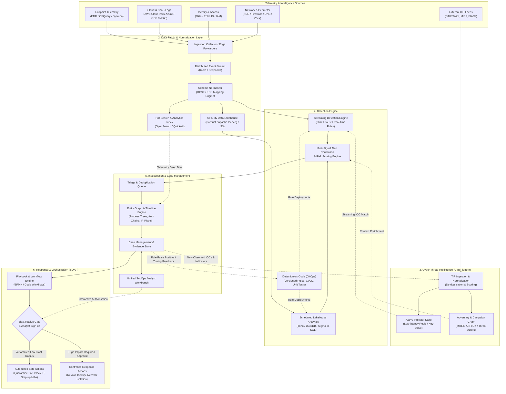

# TIDIR Target System Architecture

This document defines the high-level target component architecture for the unified Threat Intelligence, Detection, Investigation & Response (TIDIR) platform.

---

## 1. System Topology Diagram

---

## 2. Architecture Layers & Responsibilities

### Layer 1: Telemetry & Intelligence Sources
- **Telemetry Variety**: Collects heterogeneous telemetry across host execution (process creation, file operations, registry/daemon updates), network interactions (DNS, NetFlow, TLS handshakes), identity sessions (authentication, token generation, role assignment), and cloud management plane operations.
- **External CTI Ingestion**: Ingests structured threat data from commercial feeds, open-source intelligence (OSINT), ISACs, and government disclosures via STIX/TAXII standards.

### Layer 2: Data Fabric & Normalization
- **Distributed Streaming Bus**: Buffers high-volume events using partitioned, append-only distributed logs (e.g. Apache Kafka or Redpanda) to guarantee decoupled, backpressure-tolerant processing.
- **OCSF Normalization**: All incoming telemetry is parsed and coerced into the Open Cybersecurity Schema Framework (OCSF) to decouple downstream detection logic from proprietary log formats.
- **Dual-Tier Storage Strategy**:
  - **Hot Tier**: Fast, indexed storage (15–30 days) for sub-second analytical query response during active investigations and triage.
  - **Lakehouse Tier**: Parquet/Apache Iceberg columnar storage on object storage for cost-effective multi-year retention, large-scale retroactive hunting, and baseline statistical modelling.

### Layer 3: Cyber Threat Intelligence (CTI) Platform
- **Threat Indicator Lifecycle**: Ingests, normalizes, deduplicates, and scores IOCs (IPs, hashes, domains, URIs).
- **Adversary Context**: Maps indicators and attack techniques to MITRE ATT&CK matrices, threat actor profiles, and campaign identifiers.
- **Indicator Cache**: Exposes ultra-low-latency in-memory lookups for streaming detection rules while maintaining a graph representation for analyst exploration.

### Layer 4: Detection Engine
- **Streaming Real-Time Analytics**: Stateful stream processing engines continuously evaluate rules against normalized events in flight with sub-second latency.
- **Lakehouse Batch Analytics**: Scheduled batch evaluations execute complex statistical aggregation, cross-telemetry joins, and baseline anomaly detection against historical lakehouse data.
- **Multi-Signal Correlation**: Converts individual signal alerts into correlated incidents based on common entities (users, devices, network endpoints, attack chains).
- **Detection-as-Code (DaC)**: Rules are written in declarative formats (e.g. Sigma, OCSF-native queries), tracked in Git, and deployed via automated CI/CD pipelines with regression test suites.

### Layer 5: Investigation & Case Management
- **Entity Resolution & Graph Visualization**: Links alerts, users, IP addresses, processes, and domains into an interactive relational graph to uncover the full scope of adversary activity.
- **Chronological Timeline Reconstruction**: Automatically stitches disparate events into an interactive master forensic timeline.
- **Case Dossier & Evidence Chain of Custody**: Persists case notes, evidence artifacts, analyst hypotheses, and findings with tamper-evident auditing.

### Layer 6: Response & Orchestration (SOAR)
- **Declarative Playbooks**: Codified workflows automate containment, enrichment, and remediation steps.
- **Blast-Radius Gating**: Classifies actions by impact risk. Non-disruptive actions (e.g., pulling memory snapshots, querying DNS, isolating test assets) execute autonomously; disruptive actions (e.g., revoking executive credentials, enterprise firewall bans) enforce mandatory analyst approval gates.
- **Continuous Feedback**: Artifacts discovered during triage and investigation feed back directly into the CTI platform (generating new internal indicators) and the Detection-as-Code repository (tuning thresholds or closing detection blind spots).

---

## 3. Data Contracts & Standard Protocols

| Boundary / Interface | Protocol / Standard | Purpose |
| :--- | :--- | :--- |
| Telemetry Ingestion | OCSF (Open Cybersecurity Schema Framework) | Common event structure across endpoint, cloud, network, and identity |
| Threat Intelligence | STIX 2.1 / TAXII 2.1 | Machine-readable threat actor profiles, TTPs, and indicator feeds |
| Detection Logic | Sigma / YAML DSL | Vendor-agnostic detection rules convertible to streaming or SQL engines |
| Automation & Events | CloudEvents / OpenAPI | Standardized event payloads for triggering SOAR workflows and actions |
| Lakehouse Schema | Apache Iceberg / Apache Parquet | High-performance, open columnar format for historical retention |

---

## 4. Next Steps & Detailed Specs
- Read the [Capability Model](02-capability-model.md) for functional breakdown.
- Consult the component specifications in `docs/architecture/components/` for domain-level engineering blueprints.
