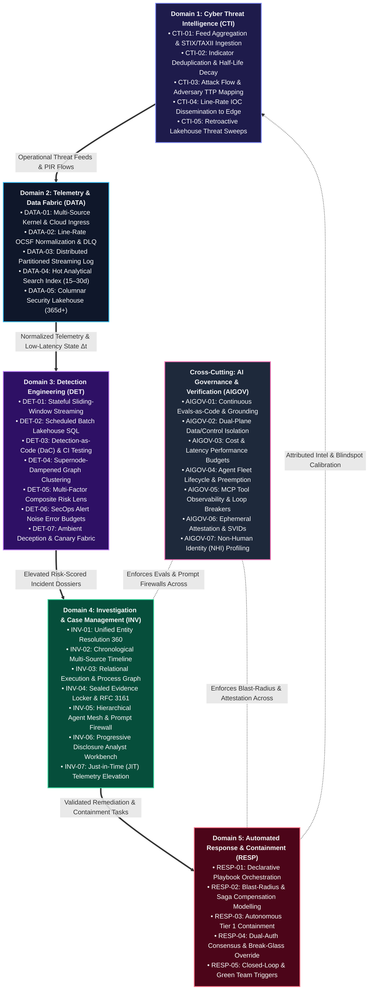

# TIDIR Capability Model

This document specifies the functional capability taxonomy required across the Threat Intelligence, Detection, Investigation & Response lifecycle.

---

## 1. Capability Taxonomy Matrix

The TIDIR capability model defines **twenty-nine operational capabilities** organized across five functional domains, underpinned by **seven cross-cutting AI Governance and Verification capabilities** (36 capabilities in total), spanning from raw sensory ingestion to closed-loop response automation:

---

## 2. Functional Capability Domains

### Domain 1: Cyber Threat Intelligence (CTI)

| Capability ID | Name | Execution Mode | Description | Key Metric / SLA |
| :--- | :--- | :--- | :--- | :--- |
| **CTI-01** | Feed Aggregation & Ingestion | `[Deterministic Engine]` | Ingest commercial, open-source, ISAC, and internal telemetry feeds via STIX/TAXII, REST, and streaming endpoints. | Ingestion latency < 5 min from publication |
| **CTI-02** | Deduplication & Confidence Scoring | `[Deterministic Engine]` | Normalize disparate indicator types, resolve overlapping claims, and compute decay scores over time. | Automated decay curves calculated daily |
| **CTI-03** | Adversary & TTP Mapping | `[AI/Agent-Augmented]` | Attribute techniques, tactics, and procedures to MITRE ATT&CK enterprise matrices using LLM advisory parsing. | 100% of validated alerts tagged with ATT&CK TTPs |
| **CTI-04** | Streaming IOC Dissemination | `[Deterministic Engine]` | Publish active, high-confidence indicators to edge detection layers with minimal lookup overhead. | Indicator broadcast to detection tier < 30 sec |
| **CTI-05** | Retroactive Sweep (Retro-Hunt) | `[Deterministic Engine]` | Automatically sweep historical lakehouse telemetry upon discovery of novel zero-day IOCs/TTPs. | 90-day sweep executed in < 15 min |

---

### Domain 2: Telemetry & Data Fabric

| Capability ID | Name | Execution Mode | Description | Key Metric / SLA |
| :--- | :--- | :--- | :--- | :--- |
| **DATA-01** | Multi-Source Ingestion | `[Deterministic Engine]` | Collect telemetry from host kernel instrumentation, cloud control planes, identity token sessions (OCSF 3002), and network sensors. | Zero loss, durable acknowledgement |
| **DATA-02** | Canonical Schema Normalization | `[Deterministic Engine]` | Coerce raw schema structures into OCSF (Open Cybersecurity Schema Framework) objects at line rate with unmapped data catch-all. | Normalization overhead < 5ms per event |
| **DATA-03** | Distributed Stream Buffering | `[Deterministic Engine]` | Decouple collectors from consumers using partitioned, distributed append-only streaming logs. | Sustained ingestion capacity ≥ 500k EPS |
| **DATA-04** | Hot Analytics Index | `[Deterministic Engine]` | Provide low-latency search, aggregations, and filtering over recent telemetry (15–30 days). | P95 search latency < 2 sec |
| **DATA-05** | Historical Security Lakehouse | `[Deterministic Engine]` | Store long-term telemetry in open columnar formats with partition pruning and compaction on object storage. | 365+ day retention with sub-linear cost |

---

### Domain 3: Detection Engineering

| Capability ID | Name | Execution Mode | Description | Key Metric / SLA |
| :--- | :--- | :--- | :--- | :--- |
| **DET-01** | Real-Time Stream Detection | `[Deterministic Engine]` | Evaluate sliding-window stateful rules, in-flight token replay, and pattern matches against streaming events. | Time-to-detect (MTTD) < 5 seconds |
| **DET-02** | Lakehouse Batch Analytics | `[Deterministic Engine]` | Execute complex, cross-table SQL analytics, behavioural baselines, and rare event heuristics. | Daily/hourly schedules (MTTD < 24h) |
| **DET-03** | DaC & Continuous Purple Team | `[AI/Agent-Augmented]` | Manage rules as declarative code validated via continuous automated atomic adversary emulation and multi-model consensus. | 100% rule tests passing prior to production deploy |
| **DET-04** | Alert Correlation & Aggregation | `[Deterministic Engine]` | Cluster related alerts across time, host, identity, and network into coherent incident candidates via entity graphs. | Reduction of alert volume to analyst by > 75% |
| **DET-05** | Bayesian Multi-Signal Risk Lens | `[Deterministic Engine]` | Neutralise the Base Rate Fallacy by compounding orthogonal evidence vectors (asset, identity, network) before elevation. | Dynamic composite score (0–100); false alarms < 5% |
| **DET-06** | SecOps Error Budgets | `[Deterministic Engine]` | Enforce monthly false-positive Noise Budgets per detection class in CI/CD; automated deployment freeze on budget burn. | Rolling 30-day Noise Ratio <= 5% per domain |
| **DET-07** | Deception & Canary Surface Fabric | `[Deterministic Engine]` | Embed lightweight honeytokens, Kerberos SPN decoys, and file lures emitting OCSF canary events for zero-noise detection. | False Positive Rate = 0.00%; MTTD < 1 second |

---

### Domain 4: Investigation & Case Management

| Capability ID | Name | Execution Mode | Description | Key Metric / SLA |
| :--- | :--- | :--- | :--- | :--- |
| **INV-01** | Entity Resolution | `[Deterministic Engine]` | Disambiguate and cross-reference identities (usernames, email, Kerberos tickets, hostnames, IP addresses). | Unified entity profile generation < 1 sec |
| **INV-02** | Interactive Timeline Reconstruction | `[Deterministic Engine]` | Automatically construct a chronological sequence of actor actions, child processes, and auth events. | Multi-source timeline generation < 5 sec |
| **INV-03** | Relational Graph Exploration | `[Deterministic Engine]` | Provide interactive graph visualization showing nodes (hosts, users, files, domains) and edges (relations). | Render graphs with > 10,000 nodes smoothly |
| **INV-04** | Evidence Dossier & Auditability | `[Deterministic Engine]` | Maintain immutable records of investigative queries, pinned artifacts, analyst notes, and tags. | Tamper-evident audit logging of analyst actions (RFC 3161) |
| **INV-05** | Agent Mesh & Multi-Model Consensus | `[AI/Agent-Augmented]` | Coordinate autonomous specialist subagents with adversarial Proposer/Challenger model arbitration behind prompt firewalls. | Time-to-investigate (MTTI) < 60s; > 80% consensus |
| **INV-06** | Progressive Disclosure Workbench | `[Human-in-the-Loop]` | Surface structured briefings in a 3-tier hierarchy (Situation Report ➔ Evidence Table ➔ On-Demand Graph Lineage). | Analyst triage comprehension < 60 sec |
| **INV-07** | Just-in-Time (JIT) Telemetry Elevation | `[AI/Agent-Augmented]` | Programmatically command edge sensors to elevate collection fidelity (eBPF, PCAP, memory) for bounded windows (TTL <= 30m). | Elevation command dispatch < 10 sec; 48h auto-eviction |

---

### Domain 5: Automated Response & Containment

| Capability ID | Name | Execution Mode | Description | Key Metric / SLA |
| :--- | :--- | :--- | :--- | :--- |
| **RESP-01** | Declarative Playbook Orchestration | `[Deterministic Engine]` | Execute multi-step containment, enrichment, and recovery workflows across third-party APIs via distributed Sagas. | Execution step dispatch < 500ms |
| **RESP-02** | Asymmetric Containment & Forward Escalation | `[AI/Agent-Augmented]` | Fail-secure execution that never rolls back containment on partial failure; executes forward perimeter escalation on error. | Fail-secure posture 100%; MTTR < 60 min |
| **RESP-03** | Autonomous Rapid Containment | `[Deterministic Engine]` | Execute instantaneous containment for low-blast-radius actions (e.g. host isolation in sandbox, token invalidation). | Time-to-contain (MTTC) < 15 seconds |
| **RESP-04** | Dual-Auth & Break-Glass Protocols | `[Human-in-the-Loop]` | Enforce multi-signature consensus for high-impact actions with authenticated single-commander break-glass overrides. | MTTC < 5 min; break-glass audit broadcast < 5 sec |
| **RESP-05** | Closed-Loop & Green Team Triggers | `[Deterministic Engine]` | Extract confirmed indicators for CTI, calibrate DaC rules, and synthesize IaC hardening pull requests for Green Teams to improve defense-in-depth. | Closed-loop & hardening dispatch automated on case closure |

---

### Cross-Cutting Domain: AI Governance & Verification (AIGOV)

| Capability ID | Name | Execution Mode | Description | Key Metric / SLA |
| :--- | :--- | :--- | :--- | :--- |
| **AIGOV-01** | Continuous Evals-as-Code | `[AI/Agent-Augmented]` | Automated CI/CD benchmarking of triage prompts and agent workflows against versioned golden incident datasets. | $\ge 95\%$ grounding fidelity; 100% schema tool validity |
| **AIGOV-02** | Dual-Plane Data/Control Isolation | `[Deterministic Engine]` | Enforces strict boundaries preventing unformatted raw telemetry strings from acting as agent control instructions. | Zero instruction execution from untrusted log payloads |
| **AIGOV-03** | Cost & Latency Performance Budgets | `[Deterministic Engine]` | Deterministic per-invocation token ceilings, query timeouts, and rate budgeting across model runtimes. | P95 agent triage latency < 5 sec; strict budget compliance |
| **AIGOV-04** | Agent Fleet Lifecycle & Preemption | `[Deterministic Engine]` | Centralized supervisor tracking agent liveness, heartbeats, zombie task reaping, and priority preemption under Sev-1 crises. | Worker zombie reap < 15 sec; preemption cascade < 1 sec |
| **AIGOV-05** | MCP Tool Observability & Loop Breakers | `[Deterministic Engine]` | OTel telemetry across MCP servers, parameter schema drift audits, and semantic query oscillation circuit breakers. | Max 8 recursive tool hops; loop termination < 100ms |
| **AIGOV-06** | Ephemeral Agent Attestation & SVIDs | `[Deterministic Engine]` | Cryptographic SPIFFE/SPIRE attestation issuing task-scoped, short-lived X.509 SVIDs (TTL <= 15m) for every agent worker. | Dynamic SVID minting < 100ms; auto-revocation on task closure |
| **AIGOV-07** | Non-Human Identity (NHI) Profiling | `[Deterministic Engine]` | Line-rate behavioral profiling and anomaly detection for service accounts, API keys, and machine tokens across clouds. | 14-day baseline drift alert; token replay detection < 5 sec |

