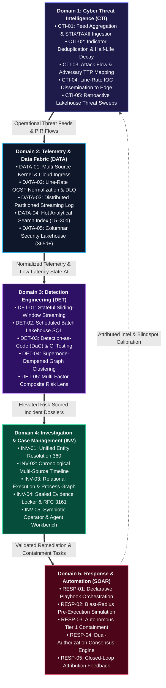

# TIDIR Capability Model

This document specifies the functional capability taxonomy required across the Threat Intelligence, Detection, Investigation & Response lifecycle.

---

## 1. Capability Taxonomy Matrix

The TIDIR capability model defines twenty-five core functional capabilities organized across five operational domains, spanning from raw sensory ingestion to closed-loop response automation:

---

## 2. Functional Capability Domains

### Domain 1: Cyber Threat Intelligence (CTI)

| Capability ID | Name | Description | Key Metric / SLA |
| :--- | :--- | :--- | :--- |
| **CTI-01** | Feed Aggregation & Ingestion | Ingest commercial, open-source, ISAC, and internal telemetry feeds via STIX/TAXII, REST, and streaming endpoints. | Ingestion latency < 5 min from publication |
| **CTI-02** | Deduplication & Confidence Scoring | Normalize disparate indicator types, resolve overlapping claims, and compute decay scores over time. | Automated decay curves calculated daily |
| **CTI-03** | Adversary & TTP Mapping | Attribute techniques, tactics, and procedures to MITRE ATT&CK enterprise matrices. | 100% of validated alerts tagged with ATT&CK TTPs |
| **CTI-04** | Streaming IOC Dissemination | Publish active, high-confidence indicators to edge detection layers with minimal lookup overhead. | Indicator broadcast to detection tier < 30 sec |
| **CTI-05** | Retroactive Sweep (Retro-Hunt) | Automatically sweep historical lakehouse telemetry upon discovery of novel zero-day IOCs/TTPs. | 90-day sweep executed in < 15 min |

---

### Domain 2: Telemetry & Data Fabric

| Capability ID | Name | Description | Key Metric / SLA |
| :--- | :--- | :--- | :--- |
| **DATA-01** | Multi-Source Ingestion | Collect telemetry from host kernel instrumentation, cloud control planes, identity providers, and network sensors. | Zero loss, durable acknowledgement |
| **DATA-02** | Canonical Schema Normalization | Coerce raw schema structures into OCSF (Open Cybersecurity Schema Framework) objects at line rate with unmapped data catch-all. | Normalization overhead < 5ms per event |
| **DATA-03** | Distributed Stream Buffering | Decouple collectors from consumers using partitioned, distributed append-only streaming logs. | Sustained ingestion capacity > 100k EPS |
| **DATA-04** | Hot Analytics Index | Provide low-latency search, aggregations, and filtering over recent telemetry (15–30 days). | P95 search latency < 2 sec |
| **DATA-05** | Historical Security Lakehouse | Store long-term telemetry in open columnar formats with partition pruning and compaction on object storage. | 365+ day retention with sub-linear cost |

---

### Domain 3: Detection Engineering

| Capability ID | Name | Description | Key Metric / SLA |
| :--- | :--- | :--- | :--- |
| **DET-01** | Real-Time Stream Detection | Evaluate sliding-window stateful rules and pattern matches against streaming events. | Time-to-detect < 5 seconds |
| **DET-02** | Lakehouse Batch Analytics | Execute complex, cross-table SQL analytics, behavioural baselines, and rare event heuristics. | Daily/hourly schedules with auto-retries |
| **DET-03** | Detection-as-Code Pipeline | Manage rules as vendor-neutral declarative code artifacts tested via automated CI/CD synthetic data runners. | 100% rule tests passing prior to production deploy |
| **DET-04** | Alert Correlation & Aggregation | Cluster related alerts across time, host, identity, and network into coherent incident candidates. | Reduction of alert volume to analyst by > 75% |
| **DET-05** | Contextual Risk Scoring | Dynamically score incidents based on asset criticality, user risk, and indicator confidence. | Dynamic composite score (0–100) assigned |

---

### Domain 4: Investigation & Case Management

| Capability ID | Name | Description | Key Metric / SLA |
| :--- | :--- | :--- | :--- |
| **INV-01** | Entity Resolution | Disambiguate and cross-reference identities (usernames, email, Kerberos tickets, hostnames, IP addresses). | Unified entity profile generation < 1 sec |
| **INV-02** | Interactive Timeline Reconstruction | Automatically construct a chronological sequence of actor actions, child processes, and auth events. | Multi-source timeline generation < 5 sec |
| **INV-03** | Relational Graph Exploration | Provide interactive graph visualization showing nodes (hosts, users, files, domains) and edges (relations). | Render graphs with > 10,000 nodes smoothly |
| **INV-04** | Evidence Dossier & Auditability | Maintain immutable records of investigative queries, pinned artifacts, analyst notes, and tags. | Tamper-evident audit logging of analyst actions |
| **INV-05** | SecOps Collaborative Workspace | Multi-analyst case assignment, handoffs, comments, and task workflows. | Real-time state synchronization |

---

### Domain 5: Response & Automation (SOAR)

| Capability ID | Name | Description | Key Metric / SLA |
| :--- | :--- | :--- | :--- |
| **RESP-01** | Declarative Playbook Orchestration | Execute multi-step containment, enrichment, and recovery workflows across third-party APIs. | Execution step dispatch < 500ms |
| **RESP-02** | Blast-Radius Risk Gating | Classify actions by business disruption risk, automatically gating critical actions behind authorization. | Zero unauthorized high-impact executions |
| **RESP-03** | Autonomous Rapid Containment | Execute instantaneous containment for low-blast-radius actions (e.g. host isolation in sandbox, file quarantine). | Action complete < 15 seconds from trigger |
| **RESP-04** | Interactive Authorization Gateways | Send interactive approvals to analysts or asset owners (chatops webhooks, mobile push, analyst workbench) with 1-click controls. | Approval state reflected instantly |
| **RESP-05** | Closed-Loop Feedback Integration | Extract confirmed indicators and attack patterns from resolved cases to feed CTI and detection tuning. | Feedback loop dispatch automated on case closure |

