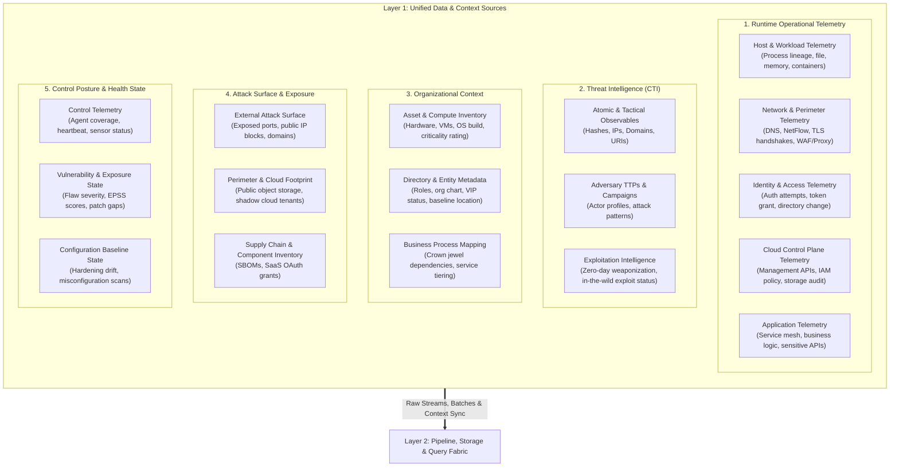
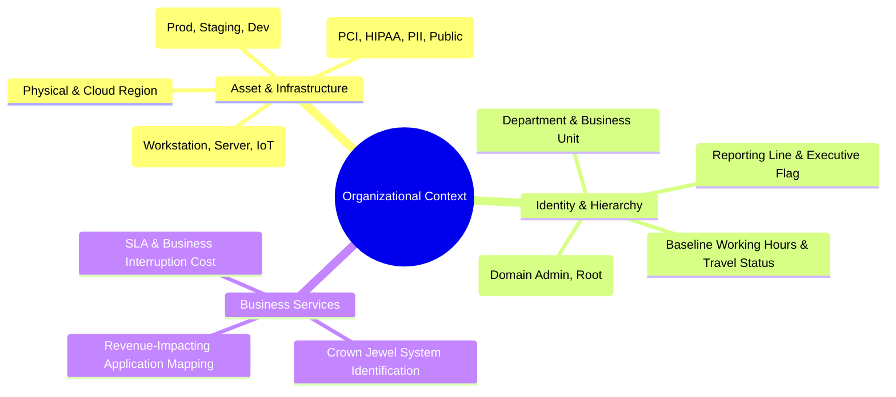

# Layer 1: Data Sources & Environmental Inputs

## 1. Overview & Architectural Role

**Layer 1 represents the total sensory boundary of the TIDIR architecture.** It encompasses all information producers feeding into the security operations ecosystem. 

A modern detection and response architecture fails when it treats security as a pure "log ingestion" problem. Effective detection and triage require evaluating **runtime operational telemetry** against **organizational reality**, **external adversary behavior**, **attack surface exposure**, and **control efficacy**.



---

## 2. Source Domain Taxonomy & Functional Capabilities

### Domain 1: Runtime Operational Telemetry
Operational telemetry represents ephemeral, high-volume event streams generated by systems, users, and workloads as activity occurs.

| Capability Group | Functional Signals Emitted | Architectural Value & Semantics |
| :--- | :--- | :--- |
| **Host & Workload Observability** | • Process creation, termination, and complete lineage (parent/child relations)<br>• Dynamic library/module loading and thread injection<br>• File system modifications (creation, deletion, overwrite, permissions)<br>• Kernel driver loading and system call anomalies<br>• Container lifecycle, cgroup violations, and namespace escapes | Provides ground truth for code execution, persistence mechanisms, and local lateral movement. Requires continuous, low-overhead agent emission. |
| **Identity & Access Telemetry** | • Interactive and programmatic authentication attempts<br>• Multi-factor challenge states, successes, and failures<br>• Token grants, refreshes, session duration, and revocation<br>• Privilege escalations and administrative role assignments<br>• Directory object modifications (user provisioning, group membership) | Foundation of identity-based detection. Detects credential stuffing, token theft, privilege creep, and anomalous authentication vectors. |
| **Network & Perimeter Telemetry** | • Flow summaries (source/dest IP, port, protocol, byte/packet count, flags)<br>• Application-layer protocol records (DNS queries/responses, HTTP/S requests)<br>• TLS handshake metadata (cipher suites, SNI, JA3/JA4 fingerprints, cert chains)<br>• Ingress/egress perimeter state changes and firewall drops | Essential for detecting command-and-control (C2) beaconing, data staging/exfiltration, and perimeter scanning without requiring invasive payload inspection. |
| **Cloud Control Plane Telemetry** | • Management console logins and administrative sessions<br>• Cloud API invocations (resource creation, deletion, configuration)<br>• IAM policy mutations, cross-account trust adjustments<br>• Storage bucket access policy modifications and public access toggles<br>• Infrastructure-as-Code deployment execution logs | Captures control-plane manipulation, privilege escalation in cloud environments, and unauthorized infrastructure provisioning. |
| **Application & API Telemetry** | • High-risk business logic executions (funds transfer, data export, admin overrides)<br>• Service mesh ingress/egress transactions<br>• API gateway requests, responses, and token validations | Protects the application tier and exposes insider threats operating through legitimate authorized application workflows. |

---

### Domain 2: Threat Intelligence Inputs (CTI)
Threat intelligence inputs provide external and internally curated adversary knowledge, converting raw operational telemetry into contextual security alerts.

| Input Category | Functional Attributes | Ingestion Mechanics & Freshness Requirements |
| :--- | :--- | :--- |
| **Atomic & Tactical Observables** | • Cryptographic file hashes (SHA256, ImpHash, SSDEEP)<br>• Network indicators (IP addresses, CIDRs, FQDNs, URLs)<br>• Certificate serials, public key hashes, JA3/JA4 fingerprints<br>• Email sender patterns and subject fingerprints | High-frequency streaming or polling ingestion (minutes). Requires confidence scoring, source tracking, and decay attributes. |
| **Operational & Adversary Behavior** | • Adversary group profiling (attribution, motivation, targets)<br>• Campaign tracking and chronological operation waves<br>• Structured TTP descriptions mapped to standardized behavior frameworks | Semi-structured batch ingestion (hourly/daily). Forms the basis of hypothesis-driven retro-hunting and detection engineering. |
| **Exploitation & Vulnerability Intel** | • Proof-of-concept (PoC) public availability signals<br>• Confirmed active exploitation in the wild<br>• Commercial and dark-web exploit broker disclosures<br>• EPSS (Exploit Prediction Scoring System) dynamic percentiles | Hourly updates. Informs automated alert severity adjustments and proactive patch prioritization. |

---

### Domain 3: Organizational & Environmental Context
Alerts cannot be accurately scored or triaged in a vacuum. Organizational context provides the baseline reality against which anomalies are weighed.



| Context Layer | Functional Capabilities | Operational Value to Detection & Response |
| :--- | :--- | :--- |
| **Asset & Compute Inventory** | • Hardware, virtual machine, container, and serverless asset registry<br>• Hostnames, static/dynamic IP allocations, MAC bindings<br>• Operating system, kernel versions, and patch levels<br>• Environment tiering (Production vs. Dev/Test sandbox) | Enables entity resolution and prevents false alarms in development environments while escalating alerts on critical production infrastructure. |
| **Identity & Role Hierarchy** | • Authoritative directory profiles (job title, department, direct manager)<br>• Privileged role assignments and break-glass account flags<br>• Standard operational locations, working hours, and language baselines | Critical for context-aware risk scoring (e.g. an IT administrator running PowerShell vs. an HR representative doing so). |
| **Business Service Mapping** | • Dependency graph linking infrastructure components to business services<br>• Financial and regulatory classification (crown jewel status) | Determines incident impact assessment, containment thresholds, and executive escalation paths. |

---

### Domain 4: Attack Surface & Exposure Inputs
Attack surface data provides the adversary's vantage point, revealing what assets and interfaces are reachable from outside the enterprise boundary.

| Exposure Vector | Functional Data Emitted | Role in Closed-Loop SecOps |
| :--- | :--- | :--- |
| **External Attack Surface (EASM)** | • Discovered public IP blocks and active routing paths<br>• External domain and subdomain enumeration<br>• Publicly accessible services, open ports, and banner information<br>• TLS certificate configurations, cipher weaknesses, and expirations | Flags newly exposed listening ports and forgotten perimeter infrastructure before exploitation occurs. |
| **Cloud Perimeter & Shadow IT** | • Publicly accessible object storage buckets or databases<br>• Unauthorized cloud accounts, tenants, or subscriptions<br>• Dangling DNS records vulnerable to subdomain takeover | Cross-referenced against cloud control plane logs to detect perimeter posture violations immediately. |
| **Supply Chain & Dependencies (SBOM)** | • Software Bill of Materials for internal and vendor applications<br>• Open-source libraries and transitive dependencies<br>• Third-party SaaS application OAuth grants and scopes | Allows instantaneous retroactive querying when third-party software vulnerabilities are disclosed. |

---

### Domain 5: Security Control Posture & Health State
The state of defensive controls determines whether detection telemetry is trustworthy and whether blind spots exist.

| Posture Domain | Functional Signals Emitted | Architectural Impact |
| :--- | :--- | :--- |
| **Sensor & Agent Health** | • Endpoint agent version, status, and running process health<br>• Last heartbeat and network connectivity timestamp<br>• Engine update status and definition freshness<br>• Tamper protection events and driver unloads | Identifies blind spots where sensors have failed, been bypassed, or were uninstalled by adversaries. |
| **Configuration & Hardening Posture** | • OS configuration benchmark compliance scores (e.g. CIS)<br>• Host-level hardening status (BitLocker/FileVault, SIP, AppLocker)<br>• Active firewall rules and listening service policies | Differentiates between hardened environments and highly permissive targets. |
| **Vulnerability & Exposure State** | • Unpatched CVEs across operating systems and installed software<br>• Severity scores (CVSS base, temporal, environmental)<br>• Exposure metrics and reachability indicators | Correlates vulnerability telemetry with threat intelligence to detect attacks targeting known unpatched flaws. |

---

## 3. Ingestion Paradigms & Data Contracts

Layer 1 feeds into Layer 2 (Pipeline, Storage & Query) through three distinct transport paradigms:

```
┌──────────────────────────────┬──────────────────────────────┬──────────────────────────────┐
│ Streaming Transport          │ Scheduled Batch Transport    │ Synchronous Context Lookup   │
│ (Sub-second Event Stream)    │ (Periodic Snapshot & Sync)   │ (On-Demand State Query)      │
├──────────────────────────────┼──────────────────────────────┼──────────────────────────────┤
│ • Host process & file events │ • Vulnerability scan results │ • Active Directory / LDAP    │
│ • Network flow logs          │ • Asset inventory sync (CMDB)│ • Threat Intel Cache (Redis) │
│ • Cloud audit API events     │ • Compliance posture reports │ • CMDB Entity Resolution API │
│ • Authentication events      │ • EASM exposure scans        │ • Agent live status check    │
└──────────────────────────────┴──────────────────────────────┴──────────────────────────────┘
```

### Architectural Contract Principles for Layer 1
1. **Producer Independence**: Data sources remain agnostic to downstream detection logic. They emit facts, not conclusions.
2. **Deterministic Time-Stamping**: All telemetry emitters must include authoritative UTC timestamps generated at the point of origin, distinct from ingestion receipt timestamps.
3. **Identity & Location Provenance**: Every event payload must preserve origin metadata (hostname, agent ID, tenant ID, source IP) to enable downstream entity resolution in Layer 2.
