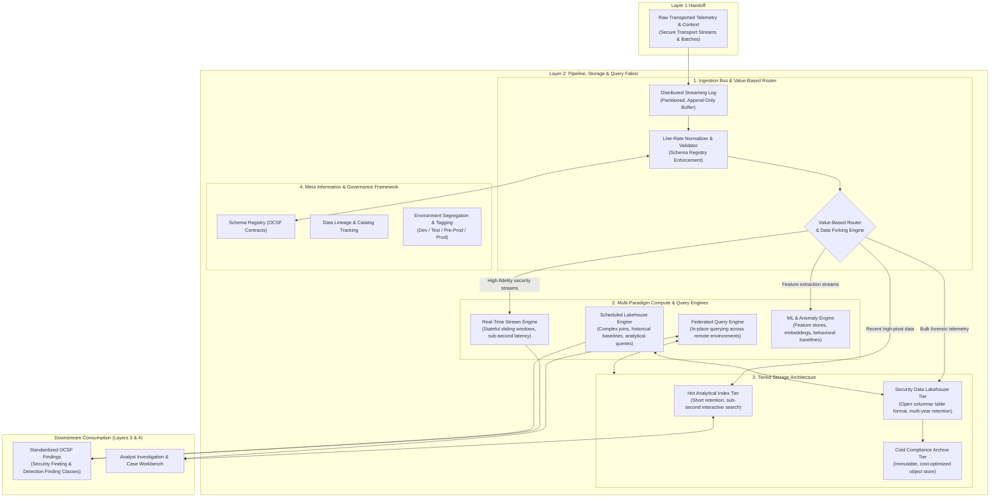
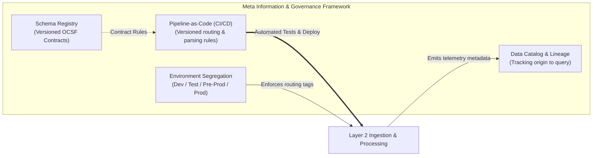

# Layer 2: Pipeline, Storage & Query Capabilities

## 1. Overview & Architectural Role

**Layer 2 represents the data fabric and computational core of the TIDIR architecture.** It bridges the sensory boundary of Layer 1 (Data Sources) with the decision intelligence of Layer 3 (Threat Intelligence & Detection) and Layer 4 (Incident Response).

Its architectural mission is to provide an elastic, multi-paradigm processing and query platform. Layer 2 ingests transported telemetry, enforces canonical normalization against open schemas, routes data dynamically based on operational value, orchestrates tiered persistence across storage media, and exposes high-performance query interfaces spanning real-time streaming, scheduled batch execution, federated analytics, and machine learning.



---

## 2. Ingestion, Line-Rate Normalization & Value-Based Routing

### Line-Rate Normalization & Contract Enforcement
Raw payloads arrive in heterogeneous formats from varied sensors, clouds, and services. Layer 2 standardizes events at line rate before long-term persistence:
- **Canonical Schema Coercion**: Events are transformed into Open Cybersecurity Schema Framework (OCSF) objects. Fields are mapped into strongly typed attributes (e.g., process execution commands, user identifiers, network endpoints).
- **Schema Validation Gate**: Inbound payloads are validated against an authoritative **Schema Registry**. Events failing validation are diverted to a dead-letter queue with error metadata for operational triage, ensuring malformed records never break downstream query engines.
- **In-Flight Context Enrichment**: During normalization, stream workers perform sub-millisecond lookups against cached organizational context from Layer 1, decorating raw events with asset criticality, physical location, and user role classifications.

### Value-Based Routing & Data Forking
Not all telemetry possesses equal analytical value. Storing petabytes of high-volume, low-density telemetry in expensive search indices creates unsustainable operational and financial strain. Layer 2 routes and shapes data based on **threat detection value vs. long-term forensic utility**:

```
                                  ┌───────────────────────────────┐
                                  │ Value-Based Routing Matrix    │
                                  └───────────────┬───────────────┘
                                                  │
                 ┌────────────────────────────────┼────────────────────────────────┐
                 ▼                                ▼                                ▼
       [Tier A: High Value]             [Tier B: Forensic Bulk]          [Tier C: Low Value / Noise]
       • Authentication anomalies       • Network flow summaries         • Sensor heartbeats
       • Process & execution trees      • Network perimeter flow logs    • Health check pings
       • Identity & API mutations       • Routine permitted traffic      • Verbose debug traces
                 │                                │                                │
                 ▼                                ▼                                ▼
      Hot Index + Stream Engine           Columnar Lakehouse Storage       Summarize / Prune at Ingress
```

1. **Tier A (High Security Value)**: Ingested into the streaming detection engine for sub-second rule evaluation and written concurrently to the **Hot Analytical Index** for rapid analyst investigation.
2. **Tier B (Forensic / Compliance Bulk)**: Bypasses the indexing tier entirely. Batched directly into open columnar files in object storage for cost-effective retention and scheduled batch query.
3. **Tier C (Noise & Chatter)**: Filtered, deduplicated, or aggregated into rolling statistical summaries (e.g., rolling connection counts per endpoint) at ingress before storage.
4. **Data Redaction & Tokenization**: Sensitive fields (PII, tokens, or credentials captured in command lines) are tokenized or masked prior to persistence.

---

## 3. Tiered Storage Architecture

Layer 2 decouples storage into three cost- and performance-optimized tiers:

| Storage Tier | Functional Characteristics | Retention Window | Primary Workload / Consumer |
| :--- | :--- | :--- | :--- |
| **Hot Analytical Index** | Inverted-index & columnar search store; low-latency field filtering and text matching. | 15–30 days | Interactive analyst investigations, alert triage, and visual dashboards. |
| **Security Data Lakehouse** | Open table format backed by object storage; columnar compression; partition-pruned by timestamp and schema class. | 365+ days | Scheduled batch analytics, complex cross-dataset joins, long-window baselining, and ML training. |
| **Cold Compliance Archive** | Immutable, write-once object storage; asynchronous retrieval lifecycle. | 3–7+ years | Regulatory compliance, legal hold, and catastrophic retroactive historical analysis. |

### Lakehouse Open Table Architecture
The security data lakehouse utilizes an open table format to guarantee performance, vendor neutrality, and durability:
- **Hidden Partitioning**: Partitioned by event timestamp (`dt=YYYY-MM-DD/hh=HH`) and schema class identifier, preventing analytical query engines from performing expensive full-table scans.
- **Snapshot Isolation & ACID Semantics**: Supports concurrent streaming writes from ingestion workers alongside heavy analytical batch queries without file locking or read-skew anomalies.
- **Schema Evolution**: Allows attributes to be added, renamed, or deprecated over multi-year spans without corrupting historic data archives.

---

## 4. Multi-Paradigm Processing & Query Capabilities

Layer 2 provides four computational engines designed for distinct temporal and analytical workloads:

```
┌────────────────────────────────────────────────────────────────────────────────────────┐
│ Multi-Paradigm Computational Engines                                                   │
├────────────────────────────┬────────────────────────────┬──────────────────────────────┤
│ 1. Real-Time Stream Engine │ 2. Scheduled Batch Engine  │ 3. Federated Query Engine    │
│ • Sliding time windows     │ • Historical baselining    │ • Query-in-place execution   │
│ • State-machine tracking   │ • Multi-table joins        │ • Remote data plane querying │
│ • Latency: < 5 seconds     │ • Latency: Minutes/Hours   │ • Zero data duplication      │
├────────────────────────────┴────────────────────────────┴──────────────────────────────┤
│ 4. Machine Learning & Feature Store Engine                                             │
│ • Continuous entity feature vectors (User/Host baseline distributions)                 │
│ • Vector embeddings for semantic search & process graph anomaly models                 │
└────────────────────────────────────────────────────────────────────────────────────────┘
```

1. **Real-Time Stream Processing**:
   - Evaluates stateful sliding windows (e.g., matching a sequence of failed authentications followed by a successful privileged session within a tight time threshold).
   - Manages local, resilient state storage with checkpointed recovery.
   - Enriches events in flight against cached Layer 1 threat intelligence indicators.

2. **Scheduled Batch Analytics**:
   - Executes long-window queries (7–90 days) over the Lakehouse tier.
   - Calculates statistical baselines and identifies rare outliers across large historical corpora.
   - Performs complex multi-table joins across disparate telemetry domains.

3. **Federated Query Engine**:
   - Reaches across remote network boundaries (e.g., separate cloud accounts, sovereign regions, or partner environments) to execute queries in place.
   - Pushes down filter predicates to remote data stores to return only matching records, avoiding costly cross-region bandwidth egress and compliance friction.

4. **Machine Learning & Feature Store Engine**:
   - Computes rolling statistical entity features (e.g., mean outbound transfer volume per workload, user typical access windows).
   - Generates and persists vector embeddings for similarity clustering across security events and execution graphs.

---

## 5. Meta Information Framework & Platform Governance

To guarantee consistency regardless of query dialect, processing language, or detection tooling, Layer 2 enforces a **Meta Information Framework**:



### Schema Registry & Language-Agnostic Abstraction
- **Contract Enforcement**: Data models are defined declaratively in a centralized registry.
- **Decoupled Interfaces**: Upstream detection engines (Layer 3) and investigation tools (Layer 4) interact with standardized OCSF query abstractions rather than physical column mappings, insulating detection logic from underlying storage changes.

### Environment Tiering & Ingestion Segregation
Layer 2 provides native support for multiple deployment tiers:
- **Environment Tagging**: Inbound telemetry is stamped at ingress with its operational source tier (`production`, `pre-production`, `test`, `development`).
- **Routing Isolation**: Non-production telemetry can be diverted to separate lakehouse prefixes or temporary indices to allow realistic security testing without polluting production alert queues.
- **Simulation & Replay Sandboxes**: Enables engineers to replay historical production data against candidate detection rules in isolated test environments.

### Pipeline-as-Code & CI/CD Deployment
All Layer 2 configurations are managed through GitOps workflows:
- **Declarative Parsers**: Normalization mappings and enrichment rules are maintained in version control.
- **Automated Validation**: Automated test suites pass synthetic data through candidate pipelines to verify schema compliance and prevent regressions before production deployment.

---

## 6. Downstream Contract: OCSF Findings & Alerts

When computation engines in Layer 2 or Layer 3 identify suspicious activity or threshold violations, they emit standardized **OCSF Finding Objects** rather than ad-hoc alerts.

### OCSF Class 2001: Security Finding
Used when a security control or automated engine identifies a confirmed vulnerability, policy violation, or baseline anomaly:
- `finding_info`: Title, description, unique identifier, creation/update timestamps, and source tool metadata.
- `severity_id`: Standardized 0–5 scale (Unknown, Informational, Low, Medium, High, Critical).
- `risk_score`: Normalized 0–100 integer reflecting asset criticality and threat context.
- `resources`: Array of affected target resources (hosts, users, databases, cloud resources).

### OCSF Class 2004: Detection Finding
Used when real-time streaming or lakehouse analytics match an active attack technique:
- `attacks`: Array of mapped MITRE ATT&CK techniques (Tactic, Technique ID, Sub-technique).
- `evidences`: The raw operational events (e.g., process execution record, DNS resolution) that triggered the detection.
- `actor`: Entity attributing the action (user identity, process lineage, session token).
- `disposition_id`: Detection disposition (e.g., Detected, Blocked, Quarantined, Suppressed).

By standardizing all findings into OCSF classes, Layer 3 and Layer 4 consume a single unified format regardless of whether the finding was generated by a real-time stream rule, a batch lakehouse query, or a machine learning anomaly model.
