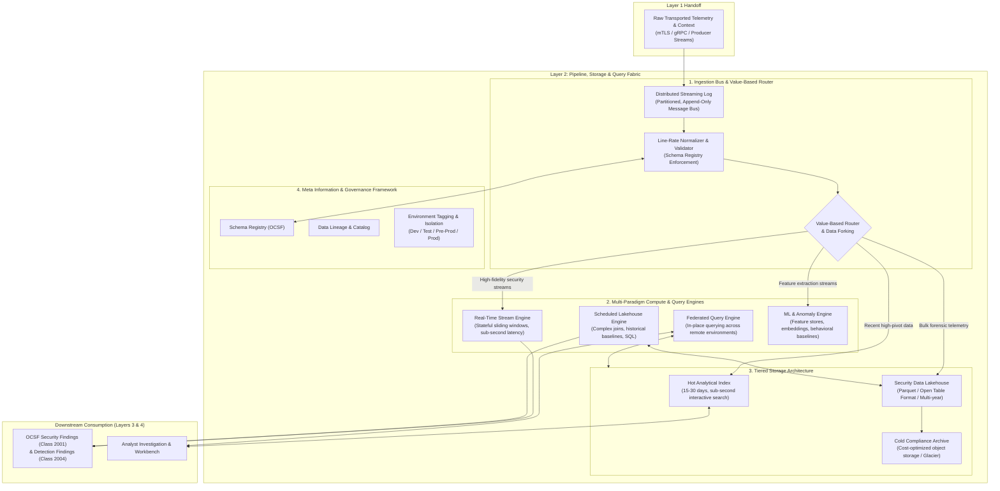
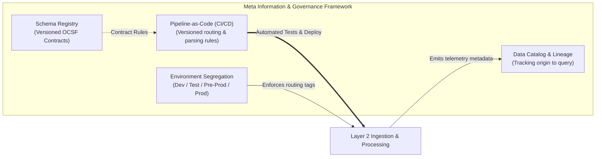

# Layer 2: Pipeline, Storage & Query Capabilities

## 1. Overview & Architectural Role

**Layer 2 is the data fabric and computational core of the TIDIR architecture.** It bridges the sensory boundary of Layer 1 (Data Sources) with the decision intelligence of Layer 3 (Threat Intelligence & Detection) and Layer 4 (Incident Response).

Its responsibility is not merely to "dump logs into storage," but to provide a high-throughput, multi-paradigm processing and query platform. Layer 2 ingests transported telemetry, enforces canonical normalization, routes data dynamically based on operational value, orchestrates tiered persistence, and exposes high-performance query interfaces spanning real-time streaming, scheduled batch execution, federated analytics, and machine learning.



---

## 2. Ingestion, Line-Rate Normalization & Value-Based Routing

### Line-Rate Normalization & Contract Enforcement
Raw payloads arrive in heterogeneous vendor formats. Layer 2 normalizes events at line rate before long-term persistence:
- **Canonical Schema Coercion**: Events are transformed into Open Cybersecurity Schema Framework (OCSF) objects. Fields are mapped into typed attributes (e.g. `process.cmd_line`, `actor.user.name`, `src_endpoint.ip`).
- **Schema Validation Gate**: Inbound events are validated against a version-controlled **Schema Registry**. Payloads failing validation are diverted to a Dead-Letter Queue (DLQ) with error metadata for triage without blocking the main pipeline.
- **In-Flight Context Enrichment**: During normalization, streaming workers perform ultra-low-latency lookups against cached Layer 1 organizational context (e.g., decorating an IP with asset criticality and department tags).

### Value-Based Routing & Data Forking
Not all telemetry possesses equal analytical value. Storing petabytes of raw firewall permits or debug logs in expensive hot search indices is financially and architecturally unsustainable. Layer 2 routes and shapes data based on **threat detection value vs. long-term forensic utility**:

```
                                  ┌───────────────────────────────┐
                                  │ Value-Based Routing Matrix    │
                                  └───────────────┬───────────────┘
                                                  │
                 ┌────────────────────────────────┼────────────────────────────────┐
                 ▼                                ▼                                ▼
       [Tier A: High Value]             [Tier B: Forensic Bulk]          [Tier C: Low Value / Noise]
       • Authentication events          • VPC Flow Logs                  • Endpoint sensor heartbeats
       • Process & execution trees      • Network NetFlow / IPFIX        • Health checks
       • Cloud IAM & API mutations      • Routine firewall accepts       • High-frequency debug logs
                 │                                │                                │
                 ▼                                ▼                                ▼
      Hot Index + Stream Engine           Lakehouse Parquet (S3)           Summarize / Discard at Edge
```

1. **Tier A (High Security Value)**: Ingested into the streaming detection engine for sub-second rule evaluation and written simultaneously to the **Hot Analytical Index** (15–30 days) for rapid analyst investigation.
2. **Tier B (Forensic / Compliance Bulk)**: Bypasses the expensive hot search cluster entirely. Micro-batched directly into columnar **Parquet/Iceberg** files in object storage for cost-effective retention and batch query.
3. **Tier C (Noise & Chatter)**: Filtered, deduplicated, or aggregated into statistical rolling summaries (e.g., rolling 5-minute connection count per IP) at the ingestion edge before persistence.
4. **Data Redaction & Tokenization**: Sensitive fields (PII, credentials accidentally captured in command lines) are tokenized or masked prior to storage.

---

## 3. Tiered Storage Architecture

Layer 2 decouples storage into three cost- and performance-optimized tiers:

| Storage Tier | Technology Characteristics | Retention Window | Primary Workload / Consumer |
| :--- | :--- | :--- | :--- |
| **Hot Analytical Index** | Distributed inverted-index & columnar search store; SSD-backed; low-latency field aggregations. | 15–30 days | Interactive analyst investigations, real-time alert triage, and dashboard visualizations. |
| **Security Data Lakehouse** | Open table format (Apache Iceberg) backed by cloud object storage; columnar Snappy/Zstandard Parquet; partition-pruned by timestamp and OCSF class. | 365+ days | Scheduled batch analytics, complex cross-dataset joins, long-window baselining, and ML training. |
| **Cold Compliance Archive** | Immutable, write-once object storage (Glacier / Archive tier); asynchronous retrieval. | 3–7+ years | Regulatory compliance, legal holds, and catastrophic historical retro-hunting. |

### Lakehouse Table Architecture (Apache Iceberg)
The security data lakehouse utilizes **Apache Iceberg** as the open table format:
- **Hidden Partitioning**: Partitioned by event timestamp (`dt=YYYY-MM-DD/hh=HH`) and OCSF class ID (`class_uid`), preventing query engines from full-table scanning.
- **Snapshot Isolation & ACID Transactions**: Supports concurrent streaming writes from ingestion workers alongside heavy analytical batch queries from Trino/DuckDB without file locks or read-skew anomalies.
- **Schema Evolution**: Allows fields to be added, renamed, or deprecated over multi-year spans without corrupting historic data.

---

## 4. Multi-Paradigm Processing & Query Capabilities

Layer 2 provides four computational engines designed for distinct analytical temporalities:

```
┌────────────────────────────────────────────────────────────────────────────────────────┐
│ Multi-Paradigm Computational Engines                                                   │
├────────────────────────────┬────────────────────────────┬──────────────────────────────┤
│ 1. Real-Time Stream Engine │ 2. Scheduled Batch Engine  │ 3. Federated Query Engine    │
│ • Sliding time windows     │ • Historical baselining    │ • Query-in-place execution   │
│ • State-machine tracking   │ • Complex cross-table joins│ • Remote cloud VPC querying  │
│ • Latency: < 5 seconds     │ • Latency: Minutes/Hours   │ • Zero data duplication      │
├────────────────────────────┴────────────────────────────┴──────────────────────────────┤
│ 4. Machine Learning & Feature Store Engine                                             │
│ • Sliding entity feature vectors (User/Host baseline distributions)                   │
│ • Vector embeddings for semantic search & process graph anomaly models                 │
└────────────────────────────────────────────────────────────────────────────────────────┘
```

1. **Real-Time Stream Processing**:
   - Evaluates stateful sliding windows (e.g. 5 failed logins followed by a success within 120 seconds).
   - In-memory state storage using RocksDB backed by distributed log checkpoints.
   - Enriches events against hot in-memory Threat Intelligence caches (Layer 1 observables).

2. **Scheduled Batch Analytics**:
   - Executes long-window queries (7–90 days) over the Lakehouse tier.
   - Calculates statistical distributions (e.g., identifying identity authentications from an ASN never observed across the organization in the past 60 days).
   - Generates daily/weekly behavioral baselines.

3. **Federated Query Engine**:
   - Reaches across remote network boundaries (e.g., separate cloud accounts, sovereign regions, or partner data centers) to execute queries in place.
   - Pushes down predicates to remote data stores to return only the filtered result set, avoiding costly egress bandwidth and compliance violations.

4. **Machine Learning & Feature Store Engine**:
   - Computes continuous statistical entity features (e.g., mean outbound bytes per host, user working hour distribution).
   - Generates and persists vector embeddings for similarity matching across alerts and process trees.

---

## 5. Meta Information Framework & Platform Governance

To ensure consistency regardless of which programming language, detection engine, or query interface interacts with Layer 2, the architecture defines a **Meta Information Framework**:



### Schema Registry & Language-Agnostic Abstraction
- **Schema Contracts**: All data schemas are maintained as declarative Protocol Buffers or JSON Schemas in a central registry.
- **Decoupled Interfaces**: Detection engines (Layer 3) and investigation tools (Layer 4) interact with standardized OCSF query abstractions rather than raw database column names, insulating detection logic from underlying storage migrations.

### Environment Tiering & Ingestion Segregation
Layer 2 provides native support for multiple deployment environments:
- **Environment Tagging**: Inbound telemetry is tagged at ingress with its operational tier (`production`, `pre-production`, `test`, `development`).
- **Routing Isolation**: Development and test telemetry can be routed to separate lakehouse buckets or ephemeral indices to allow realistic security testing without polluting production alert queues.
- **Simulation & Replay Sandboxes**: Allows detection engineers to replay historical production data against candidate detection rules in isolated test environments.

### Pipeline-as-Code & CI/CD Deployment
All Layer 2 configuration is managed through GitOps workflows:
- **Declarative Parsers**: Normalization mappings and enrichment rules are defined in declarative code.
- **Automated Validation**: CI pipelines run synthetic data suites through candidate parsers to verify OCSF schema compliance and catch regression errors prior to production deployment.

---

## 6. Downstream Contract: OCSF Findings & Alerts

When computation engines in Layer 2 or Layer 3 identify malicious activity or threshold violations, they emit standardized **OCSF Finding Objects** rather than ad-hoc alerts.

### OCSF Class 2001: Security Finding
Used when a security control or automated engine identifies a confirmed vulnerability, policy violation, or baseline anomaly:
- `finding_info`: Title, description, UID, created/modified timestamps, and source tool metadata.
- `severity_id`: Standardized 0–5 scale (Unknown, Informational, Low, Medium, High, Critical).
- `risk_score`: Normalized 0–100 integer reflecting asset criticality and threat context.
- `resources`: Array of affected target resources (hosts, users, databases, cloud buckets).

### OCSF Class 2004: Detection Finding
Used when real-time streaming or lakehouse analytics match an active attack technique:
- `attacks`: Array of mapped MITRE ATT&CK techniques (Tactic, Technique ID, Sub-technique).
- `evidences`: The raw operational events (e.g. process creation event, DNS query) that triggered the detection.
- `actor`: Entity attributing the action (user, process, session token).
- `disposition_id`: Detection disposition (e.g. Detected, Blocked, Quarantined, Suppressed).

By standardizing all findings into OCSF classes, Layer 3 and Layer 4 consume a single unified format regardless of whether the finding was generated by a real-time stream rule, a batch lakehouse query, or a machine learning anomaly model.
