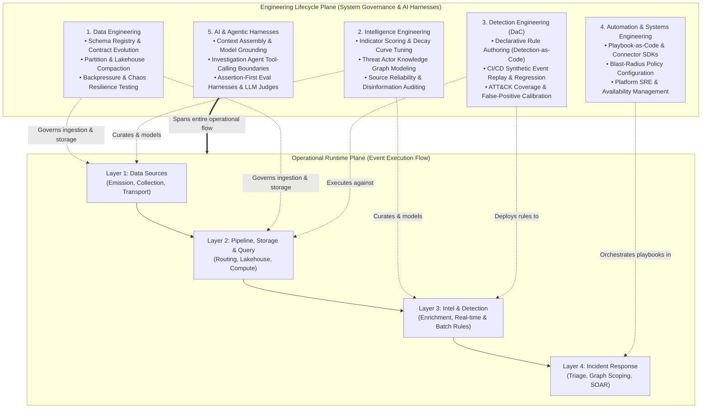
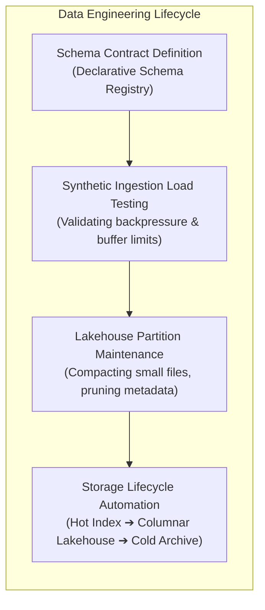
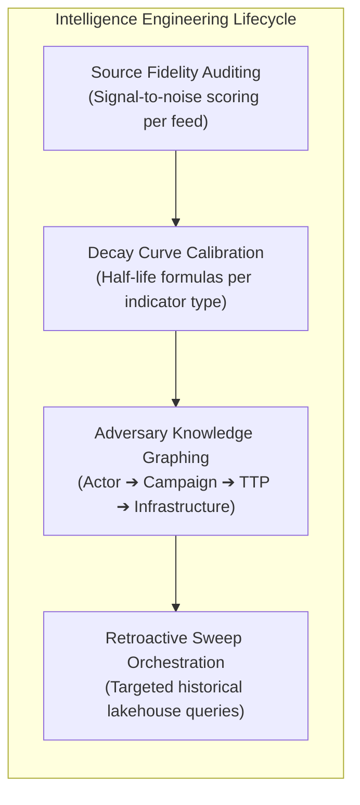
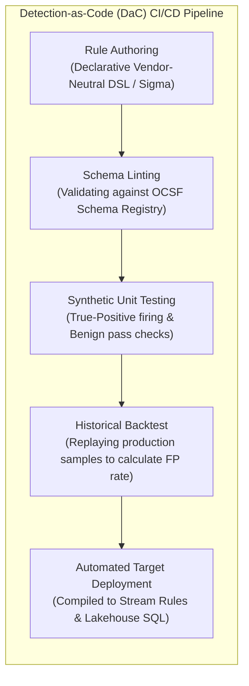
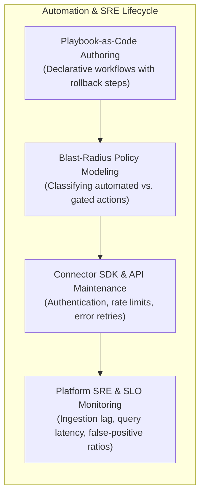
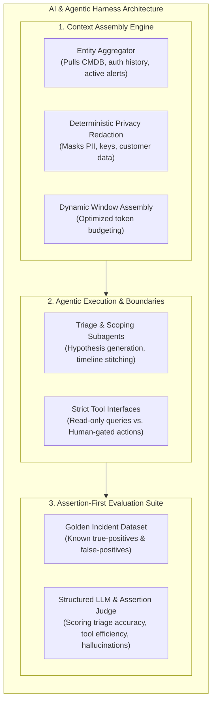

# Cross-Cutting Engineering Disciplines & AI Harnesses

## 1. Overview: The Dual-Plane Architecture

A complete security architecture must account for two orthogonal planes of reality:

1. **The Operational Runtime Plane**: The horizontal flow of data as events happen in the environment:
   $$\text{Layer 1 (Sources)} \longrightarrow \text{Layer 2 (Pipeline \& Storage)} \longrightarrow \text{Layer 3 (Intel \& Detection)} \longrightarrow \text{Layer 4 (Incident Response)}$$
2. **The Engineering Lifecycle Plane**: The vertical cross-cutting engineering disciplines that author, test, version, deploy, evaluate, and maintain the platform itself.

Without the Engineering Lifecycle Plane, security architectures devolve into brittle collections of static rules, unmaintained scripts, and uncalibrated models.

---

## 2. The Five Engineering Disciplines

### Discipline 1: Data Engineering
Data Engineering owns the reliability, throughput, schema validity, and cost-efficiency of data movement across Layers 1 and 2.

- **Schema Contract Management**: Governs changes to the Schema Registry. Enforces backward and forward compatibility checks to prevent upstream sensor changes or parser updates from corrupting downstream datasets.
- **Lakehouse Compaction & Partition Maintenance**: Continuously merges small streaming micro-batches into optimal columnar file sizes, rewrites partition manifests, and purges expired snapshots to maintain sub-second query performance over petabyte corpora.
- **Resilience & Chaos Engineering**: Injects synthetic event spikes, consumer lag, and network partitions into ingestion buffers to prove that edge spooling and backpressure throttling function without dropping forensic events.
- **Storage Lifecycle Orchestration**: Implements automated movement policies based on data age and access frequency (Hot Index $\rightarrow$ Columnar Lakehouse $\rightarrow$ Cold Archive).

---

### Discipline 2: Intelligence Engineering
Intelligence Engineering curates, validates, scores, and models adversary data into structured, actionable intelligence.

- **Indicator Scoring & Decay Modeling**: Engineers and tunes mathematical decay curves based on observable volatility:
  $$\text{Score}(t) = \text{InitialScore} \times e^{-\lambda t}$$
  Calibrates $\lambda$ so dynamic IP addresses decay within hours, while bespoke malware binary hashes remain active indefinitely.
- **Adversary Graph Modeling**: Curates relationship ontologies connecting threat actors, campaign waves, specific TTPs, and tactical infrastructure.
- **Source Fidelity & Disinformation Auditing**: Continuously measures true-positive discovery rates across external feeds, penalizing or decommissioning sources that generate false alarms or stale indicators.
- **Retroactive Sweep Orchestration**: Converts newly discovered zero-day intelligence into targeted historical queries executed automatically against lakehouse storage.

---

### Discipline 3: Detection Engineering (Detection-as-Code)
Detection Engineering treats threat logic as version-controlled, test-driven software, eliminating manual, unverified rule creation in production consoles.

- **Declarative Rule Authoring**: Rules are written in standardized, vendor-neutral formats against normalized OCSF classes rather than proprietary log fields.
- **Automated CI/CD Validation**: Every proposed detection rule undergoes automated pull request verification:
  - *Schema Linting*: Verifies that field names and types conform to the authoritative schema registry.
  - *Unit Testing*: Passes synthetic event payloads through the rule to verify that true positives fire and benign edge cases pass.
  - *Historical Volume Simulation*: Queries historical lakehouse data to calculate expected alert frequency and detect potential alert floods before deployment.
- **Coverage & Blind-Spot Analysis**: Continuously maps active detection rules against MITRE ATT&CK data components and adversary techniques to expose coverage gaps across specific environments.

---

### Discipline 4: Automation & Systems Engineering
Automation and Systems Engineering maintains the reliability, execution guarantees, and safety policies of the platform's active workflows.

- **Playbook-as-Code**: Response and investigation workflows are authored in version-controlled declarative specifications, complete with error-handling branches, idempotency checks, and compensation/rollback actions.
- **Blast-Radius Policy Modeling**: Defines the boundary between autonomous containment (Tier 1: low-risk actions like file quarantine or sandbox isolation) and gated containment (Tier 2: high-disruption actions like account lockout or network isolation requiring analyst sign-off).
- **Connector SDK & API Maintenance**: Standardizes third-party integration connectors, managing token lifecycles, exponential backoff, rate limits, and audit trails.
- **Platform SRE & Telemetry Health**: Monitors ingestion lag, pipeline consumer offsets, query P95 latencies, and end-to-end time-to-detect (TTD) metrics.

---

### Discipline 5: AI & Agentic Harnesses
AI and Agentic Harnesses introduce autonomous reasoning and acceleration across the platform, governed by strict evaluation and execution guardrails.

- **Context Assembly & Prompt Optimization**:
  - Dynamically retrieves necessary entity state, historical alert patterns, and relevant threat actor context to ground reasoning models.
  - Applies deterministic redaction for sensitive customer identifiers, passwords, and tokens before model invocation.
  - Structures prompts as **Ideal-State Criteria (ISC)** rather than prescriptive reasoning choreography, allowing capable frontier models to discover the optimal path to task completion.
- **Agent Tool Calling & Security Boundaries**:
  - Exposes typed, deterministic tool interfaces (e.g. `query_telemetry`, `lookup_ioc`, `reconstruct_process_tree`).
  - Enforces read-only operational sandboxes for autonomous agents. Any state-changing response action (e.g. host isolation) must emit an authorization proposal for human approval.
- **Assertion-First Evaluation Framework**:
  - Benchmarks agentic triage and investigation output against curated "golden incident datasets."
  - Evaluates performance using typed deterministic assertions combined with structured LLM judges to track precision, recall, and hallucination rates across model iterations.

---

## 3. Environmental Tiering & Safe Simulation

To support continuous engineering across all disciplines, the architecture mandates four distinct operational environments:

| Environment Tier | Operational Purpose | Ingestion & Telemetry Scope | Storage & Alert Isolation |
| :--- | :--- | :--- | :--- |
| **Development (`dev`)** | Authoring new parsers, detection rules, and connector scripts. | Synthetic telemetry generators; test event replays. | Ephemeral local containers; isolated mock queues. |
| **Test / Simulation (`test`)** | Automated CI/CD regression testing, unit testing, and parser fuzzing. | Curated test corpora representing both benign activity and multi-stage attack scenarios. | Dedicated test lakehouse prefix; zero production alerts emitted. |
| **Pre-Production (`pre-prod`)** | Full-scale simulation and backtesting against sanitized production data. | Mirror of production telemetry streams; sanitized PII. | Parallel lakehouse tables; shadow detection execution to measure alert volume before deployment. |
| **Production (`prod`)** | Active 24/7 security monitoring, threat detection, and incident response. | Live enterprise-wide telemetry, authoritative context, and external threat feeds. | Production Hot Index, Lakehouse, and Case Management queues. |

### The Historical Replay Sandbox
A key capability enabled by the Lakehouse tier (Layer 2) is the ability for Detection Engineers to **replay historical telemetry through candidate rules in Pre-Production**. By feeding 30 days of actual production events through a new rule in an isolated test harness, engineers measure exact true-positive vs. false-positive ratios before the rule ever touches production alert queues.
