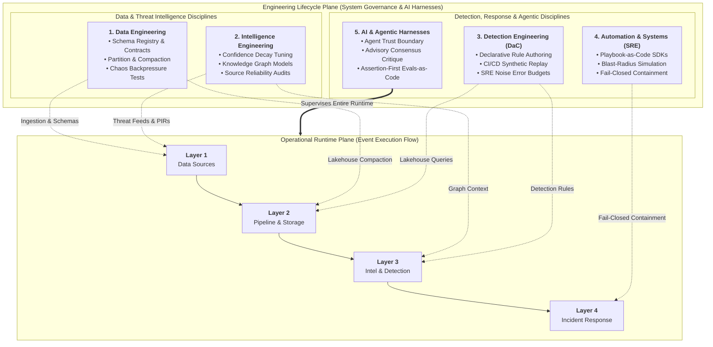
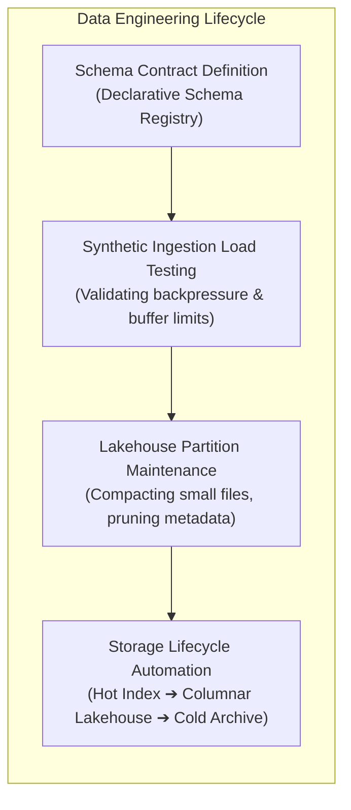
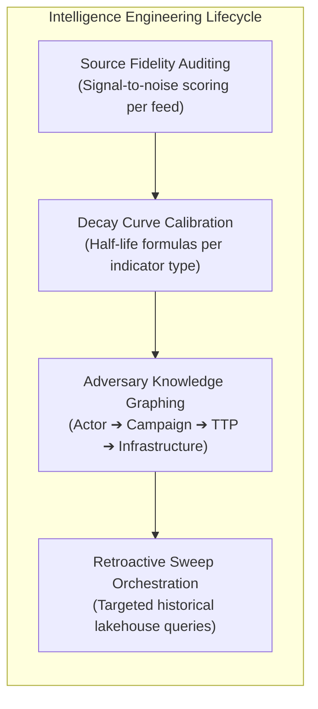
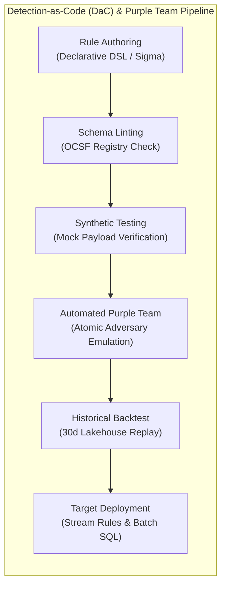
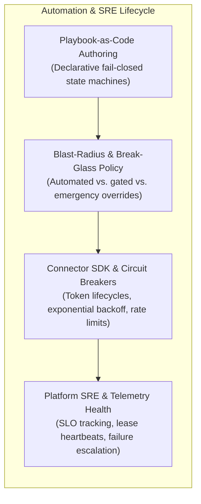
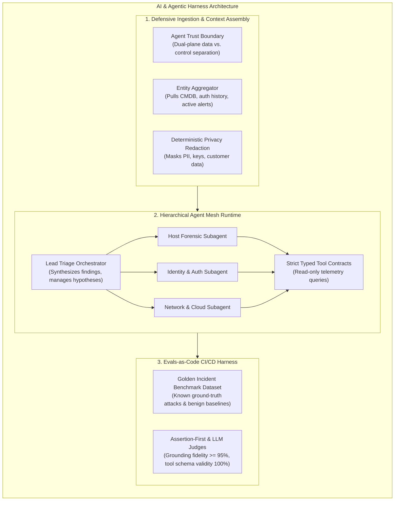
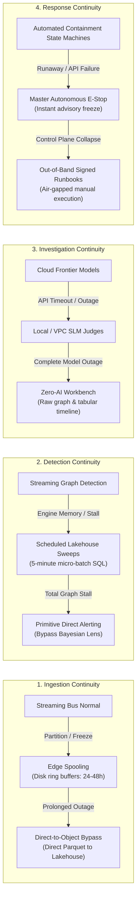

# Cross-Cutting Engineering Disciplines & AI Harnesses

## 1. Overview: The Dual-Plane Architecture

A complete security architecture must account for two orthogonal planes of reality:

1. **The Operational Runtime Plane**: The horizontal flow of data as events occur across the enterprise:
   > **Layer 1 (Data Sources)** ➔ **Layer 2 (Pipeline & Storage)** ➔ **Layer 3 (Intel & Detection)** ➔ **Layer 4 (Incident Response)**
2. **The Engineering Lifecycle Plane**: The vertical cross-cutting engineering disciplines that author, test, version, deploy, evaluate, and maintain the platform itself.

Without the Engineering Lifecycle Plane, security architectures devolve into brittle collections of static rules, unmaintained scripts, and uncalibrated models.

### 1.1 The "Run-Watch-Adapt" Operating Paradigm

To operationalise the five engineering disciplines without organisational friction, TIDIR aligns with the modern **Run-Watch-Adapt** division of responsibilities:

* **Run (Platform SRE & Data Engineering)**: Maintains pipeline uptime, consumer group lag, Schema Registry enforcement, lakehouse compaction, and downstream API connector health across Layers 1 and 2.
* **Watch (Incident Responders & Triage Analysts)**: Monitors incoming risk-scored dossiers, supervises autonomous agent findings, executes investigative pivots, and ratifies Tier 2 containment actions in Layer 4.
* **Adapt (Detection & Intelligence Engineers)**: Translates threat intelligence into machine-readable attack flows, authors declarative DaC rules, operates continuous purple team adversary emulations, and tunes detection thresholds in Layer 3.

---

## 2. The Five Engineering Disciplines

### Discipline 1: Data Engineering
Data Engineering owns the reliability, throughput, schema validity, and cost-efficiency of data movement across Layers 1 and 2.

- **Schema Contract Management**: Governs changes to the Schema Registry. Enforces backward and forward compatibility checks to prevent upstream sensor changes or parser updates from corrupting downstream datasets.
- **Lakehouse Compaction & Partition Maintenance**: Continuously merges small streaming micro-batches into optimal columnar file sizes, rewrites partition manifests, and purges expired snapshots to maintain sub-second query performance over petabyte corpora.
- **Resilience & Chaos Engineering**: Injects synthetic event spikes, consumer lag, and network partitions into ingestion buffers to prove that edge spooling and backpressure throttling function without dropping forensic events.
- **Storage Lifecycle Orchestration**: Implements automated movement policies based on data age and access frequency (Hot Index $\rightarrow$ Columnar Lakehouse $\rightarrow$ Cold Archive).

---

### Discipline 2: Intelligence Engineering
Intelligence Engineering curates, validates, scores, and models adversary data into structured, actionable intelligence.

- **Indicator Scoring & Decay Modelling**: Engineers and tunes mathematical decay curves based on observable volatility:
  $$\text{Score}(t) = \text{InitialScore} \times e^{-\lambda t}$$
  Calibrates $\lambda$ so dynamic IP addresses decay within hours, while bespoke malware binary hashes remain active indefinitely.
- **Adversary Graph Modelling**: Curates relationship ontologies connecting threat actors, campaign waves, specific TTPs, and tactical infrastructure.
- **Source Fidelity & Disinformation Auditing**: Continuously measures true-positive discovery rates across external feeds, penalizing or decommissioning sources that generate false alarms or stale indicators.
- **Retroactive Sweep Orchestration**: Converts newly discovered zero-day intelligence into targeted historical queries executed automatically against lakehouse storage.

---

### Discipline 3: Detection Engineering (Detection-as-Code)
Detection Engineering treats threat logic as version-controlled, test-driven software, eliminating manual, unverified rule creation in production consoles.

- **Polyglot Declarative Rule Authoring**: Rules are written using Polyglot Detection-as-Code ([ADR-0019](../adr/0019-polyglot-detection-as-code-and-native-engine-adaptation.md)): encapsulating vendor-neutral governance and OCSF class contracts in a YAML metadata envelope, while housing target-optimized native query implementations (KQL, SPL, SQL) for maximum execution fidelity.
- **Continuous Automated Purple Teaming**: Beyond static unit tests, candidate rules are evaluated against an active adversary emulation harness in pre-production:
  - *Atomic Adversary Emulation*: The CI/CD runner automatically executes non-destructive adversary techniques (e.g. simulated token theft or DLL search order hijacking).
  - *End-to-End Latency Verification*: Asserts that sensor hooks emit the event (Layer 1), normalization preserves required attributes (Layer 2), stream detection triggers within SLA (Layer 3), and autonomous agent scoping activates (Layer 4).
- **Automated CI/CD Validation & Historical Replay**:
  - *Schema Linting*: Verifies that field names and types conform to the authoritative schema registry.
  - *Historical Volume Simulation*: Queries a 30-day historical lakehouse sample in pre-prod to calculate the Expected Alert Volume (EAV) and reject rules that exceed noise error budgets.
- **Coverage & Blind-Spot Analysis**: Continuously maps active detection rules against MITRE ATT&CK data components and adversary techniques to expose coverage gaps across specific environments.

---

### Discipline 4: Automation & Systems Engineering
Automation and Systems Engineering maintains the reliability, execution guarantees, and safety policies of the platform's active workflows.

- **Monotonic Fail-Closed Playbook Orchestration**: Response and containment workflows are authored as declarative state machines. Under active attack, defensive perimeters move strictly in a single forward direction (increasing isolation). If a multi-step containment sequence fails midway due to downstream API timeouts, the orchestrator freezes existing barriers and executes forward perimeter escalation rather than rolling back containment.
- **Blast-Radius Modelling & Break-Glass Overrides**: Defines the boundary between autonomous containment (Tier 1: low-risk actions like workstation file quarantine) and gated containment (Tier 2: high-disruption actions like domain controller network isolation requiring multi-signature sign-off). High-velocity catastrophic threats (e.g. ransomware propagation) provide an audited **Break-Glass Emergency Protocol** permitting single-commander authorisation with out-of-band cryptographic audit broadcast.
- **Connector Circuit Breakers & API Health**: Standardises downstream integration connectors with automated circuit breakers, decoupling rate limits and preventing cascading failures across security infrastructure.
- **Platform SRE & Telemetry Health**: Monitors ingestion lag, pipeline consumer offsets, query P95 latencies, isolation lease heartbeats, and end-to-end time-to-detect (TTD) metrics.

---

### Discipline 5: AI & Agentic Harnesses
AI and Agentic Harnesses introduce autonomous reasoning and acceleration across the platform, governed by strict evaluation, cognitive isolation, and execution guardrails.

- **Defensive AI Runtime & Agent Trust Boundary**:
  - Implements **Dual-Plane Isolation**: untrusted telemetry payloads (command lines, file contents, raw logs, external CTI text) remain strictly within the data plane as typed JSON structures.
  - Controls, instructions, and tools operate exclusively in the privileged control plane. **TIDIR explicitly assumes adversarial data may influence or compromise model reasoning; security boundaries therefore do not depend on successful prompt-injection detection**. All consequential capabilities remain constrained by deterministic authorisation, typed interfaces, task-scoped machine identity (SPIFFE Verifiable Identity Documents / SVIDs), and independent execution policy.
  - Dynamically retrieves necessary entity state, historical alert patterns, and relevant threat actor context with deterministic privacy redaction.
- **Hierarchical Agent Mesh Runtime**:
  - Replaces monolithic point-prompts with an orchestrated agent hierarchy: a Lead Triage Orchestrator coordinates specialized subagents (Host Forensic, Identity & Auth, Network & Cloud) to investigate multi-vector threats concurrently.
  - Enforces typed, deterministic tool interfaces (e.g. `query_telemetry`, `lookup_ioc`, `reconstruct_process_tree`). Autonomous agents operate strictly in read-only analysis mode (Tier 0).
- **Continuous Evals-as-Code Framework**:
  - Prompts, agent guidelines, and tool schemas are maintained in version-controlled repositories tested on every Git pull request.
  - Evaluates candidate agent configurations against versioned "golden incident datasets" using deterministic assertions and structured evaluation judges, ensuring grounding fidelity $\ge 95\%$ and strict latency and token budget adherence.

---

## 3. Environmental Tiering & Safe Simulation

To support continuous engineering across all disciplines, the architecture mandates four distinct operational environments:

| Environment Tier | Operational Purpose | Ingestion & Telemetry Scope | Storage & Alert Isolation |
| :--- | :--- | :--- | :--- |
| **Development (`dev`)** | Authoring new parsers, detection rules, and connector scripts. | Synthetic telemetry generators; test event replays. | Ephemeral local containers; isolated mock queues. |
| **Test / Simulation (`test`)** | Automated CI/CD regression testing, unit testing, and parser fuzzing. | Curated test corpora representing both benign activity and multi-stage attack scenarios. | Dedicated test lakehouse prefix; zero production alerts emitted. |
| **Pre-Production (`pre-prod`)** | Full-scale simulation and backtesting against sanitized production data. | Mirror of production telemetry streams; sanitized PII. | Parallel lakehouse tables; shadow detection execution to measure alert volume before deployment. |
| **Production (`prod`)** | Active 24/7 security monitoring, threat detection, and incident response. | Live enterprise-wide telemetry, authoritative context, and external threat feeds. | Production Hot Index, Lakehouse, and Case Management queues. |

### The Historical Replay Sandbox
A key capability enabled by the Lakehouse tier (Layer 2) is the ability for Detection Engineers to **replay historical telemetry through candidate rules in Pre-Production**. By feeding 30 days of actual production events through a new rule in an isolated test harness, engineers measure exact true-positive vs. false-positive ratios before the rule ever touches production alert queues.

---

## 4. Operational Continuity, Failure Modes & Continuity Plan B

Autonomous security architectures must survive component failures without dropping telemetry or blinding operations. Formally established in [ADR-0021](/adr/0021-graceful-degradation-automated-fallback-and-continuity-plan-b), TIDIR implements a 4-tier capability-driven degradation framework:

### Deterministic Degradation Matrix

| Architectural Layer | Monitored Failure Condition | Detection Probe ("How We Know") | Automated Continuity Plan B |
| :--- | :--- | :--- | :--- |
| **Layer 1 & 2: Ingestion & Storage** | Streaming event bus partition or schema registry corruption. | Synthetic telemetry canaries fail to arrive in Layer 2 in $\le 60\text{s}$; consumer lag $\gt 60\text{s}$; DLQ $\gt 100\text{ events/min}$. | **Edge Spooling & Direct-to-Object Ingestion**: Forwarders spool to local NVMe ring buffers (24–48h capacity); prolonged partitions trigger direct-to-object upload of Parquet micro-batches directly to the columnar lakehouse. |
| **Layer 3: Threat Intel & Detection** | Graph engine stagnation, memory exhaustion, or Risk Lens stall. | Time-to-Detect (TTD) delta $\gt 15\text{s}$; zero graph mutation rate despite active ingestion; canary invariant alert failure $\gt 30\text{s}$. | **Stream-to-Batch Failover & Direct Alerting**: Scheduled 5-minute columnar SQL batch sweeps assume detection coverage; complete graph stalls bypass Bayesian compounding and route raw sensor alerts directly to analyst queues. |
| **Layer 4: AI & Investigation** | Cloud AI API outages, provider rate throttling, or network timeouts. | AI gateway circuit breakers trip after 3 consecutive HTTP 5xx errors; case hydration queue latency $\gt 60\text{s}$. | **Local SLM Fallback & Zero-AI Mode**: Traffic shifts to on-premise/VPC Small Language Models; complete model outages drop to Zero-AI mode (rendering deterministic tabular timelines and bipartite graph relationship tables). |
| **Layer 4: Response & Automation** | Containment state machine lockups, EDR API unresponsiveness, or automation runaway. | Containment retries exceed 3 attempts; isolation lease approaches 45-minute TTL; containment velocity $\gt 10\text{ hosts/min}$. | **Master E-Stop & Out-of-Band Boundary Containment**: Master cryptographic E-Stop drops playbooks to advisory mode; expired leases auto-escalate to out-of-band network boundary ACLs; operators invoke signed air-gapped CLI runbooks. |

