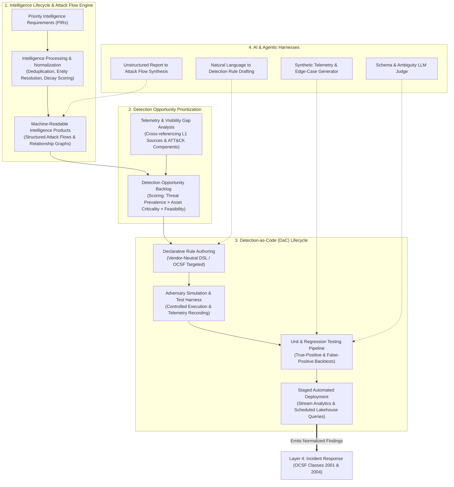
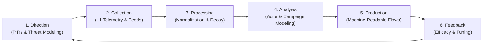
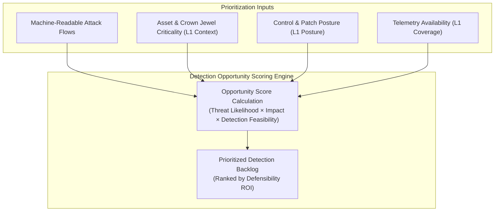
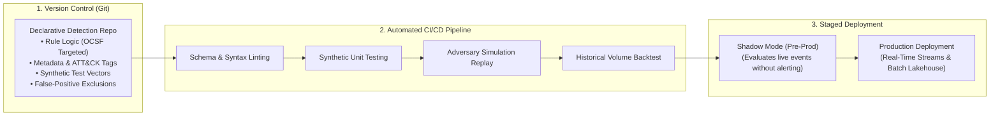
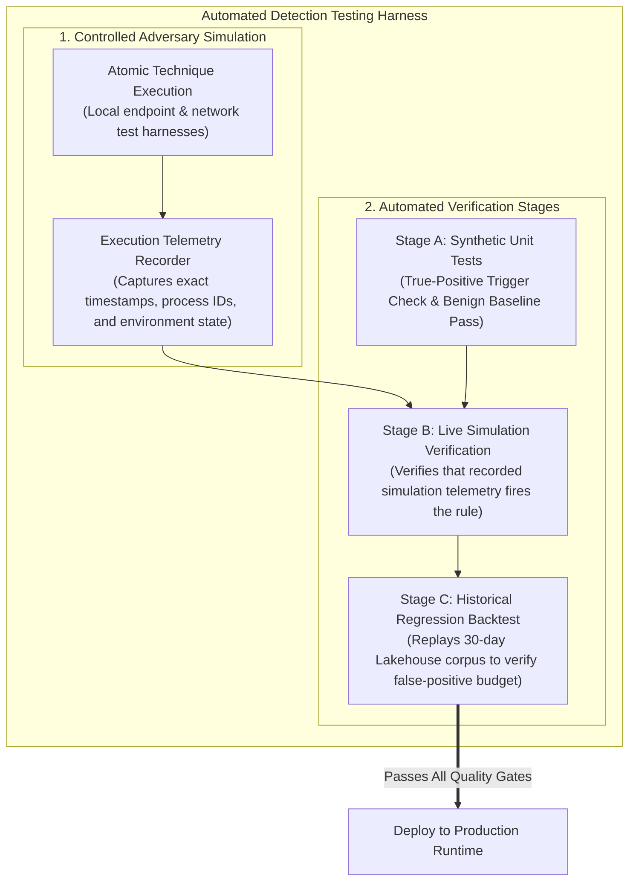
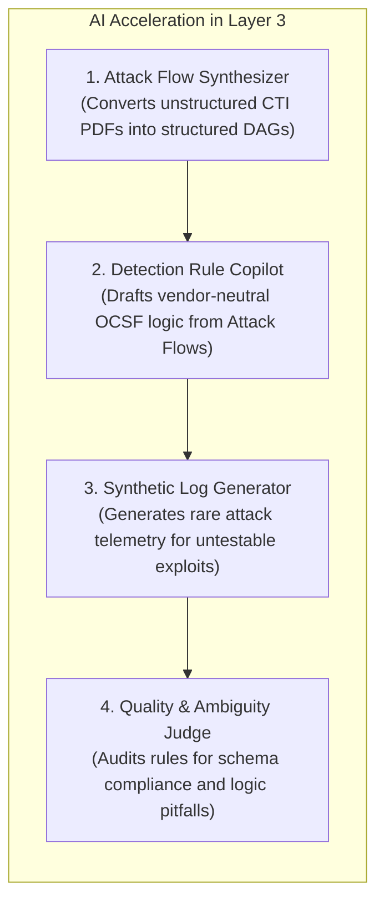
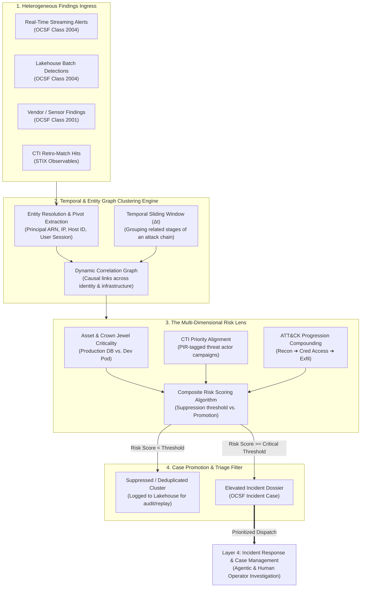

# Layer 3: Threat Intelligence & Detection Engineering

## 1. Overview & Architectural Role

**Layer 3 represents the cognitive and analytical core of the TIDIR architecture.** It synthesizes raw, normalized telemetry from Layer 2 with operational adversary context to identify active attacks, policy violations, and anomalous behaviors.

Rather than treating threat intelligence as a passive repository of static indicators and detection as an unmanaged collection of ad-hoc alerts, Layer 3 formalizes an **intelligence-driven, code-first engineering lifecycle**. Threat intelligence directly produces **machine-readable attack flows** that illuminate detection opportunities, which in turn drive test-driven **Detection-as-Code (DaC)** pipelines validated through automated adversary simulation and CI/CD regression suites.

---

## 2. The Intelligence Lifecycle & Machine-Readable Intel Products

Threat intelligence in Layer 3 operates as a structured, closed-loop discipline rather than a passive feed consumer.

### The Six Operational Intelligence Phases
1. **Direction & Planning**: Establishes Priority Intelligence Requirements (PIRs) aligned with business risks, executive threat models, and crown jewel assets.
2. **Collection**: Ingests raw threat data from Layer 1 (technical observables, vulnerability advisories, community disclosures, internal case discoveries).
3. **Processing & Normalization**: Deduplicates overlapping claims, extracts technical observables into structured entities, applies mathematical decay curves, and resolves multi-source contradictions.
4. **Analysis**: Correlates technical observables with tactical adversary behaviors, campaign waves, and threat actor profiles.
5. **Production (Machine-Readable Attack Flows)**: Generates structured, consumable intelligence products designed for direct ingestion by automated detection pipelines.
6. **Feedback & Evaluation**: Measures whether produced intelligence successfully enabled detection, prevented compromise, or produced excessive noise, refining PIRs accordingly.

### Machine-Readable Intelligence Products (MRIPs)
Traditional threat intelligence produces static PDF reports that require human interpretation. Layer 3 mandates the production of **Machine-Readable Intelligence Products**:
- **Structured Attack Flow Definitions**: Codifies multi-step adversary attack paths into directed acyclic graphs (DAGs) representing sequential and concurrent attacker steps (e.g., *Phishing Attachment $\rightarrow$ Script Execution $\rightarrow$ Process Injection $\rightarrow$ LSASS Memory Dump $\rightarrow$ SMB Lateral Movement*).
- **Contextual Relationship Schemas**: Expresses explicit relationship edges: `ThreatActor` $\xrightarrow{\text{uses}}$ `Tool` $\xrightarrow{\text{implements}}$ `AttackPattern` $\xrightarrow{\text{targets}}$ `Vulnerability` $\xrightarrow{\text{generates}}$ `TelemetryObservable`.
- **Actionable Emulation Plans**: Machine-executable step sequences detailing specific command lines, APIs, and network behaviors required to simulate the adversary during detection validation.

---

## 3. Intel-Driven Detection Opportunity Prioritization

Rather than authoring rules reactively or attempting exhaustive coverage of hundreds of generic techniques, Layer 3 utilizes a deterministic **Detection Opportunity Engine** to prioritize engineering effort.

### Detection Opportunity Scoring Algorithm
Each candidate detection opportunity is prioritized using a composite scoring model:

$$\text{Priority Score} = \frac{\text{Threat Likelihood} \times \text{Asset Exposure} \times \text{Impact Severity}}{\text{Engineering Complexity} \times \text{Noise Risk}}$$

- **Threat Likelihood**: Derived from active campaign tracking, exploit weaponization telemetry, and prevalence within targeted industry sectors.
- **Asset Exposure & Impact**: Evaluated against Layer 1 organizational context (e.g., whether vulnerable systems are public-facing or hold sensitive regulatory data).
- **Detection Feasibility & Telemetry Coverage**: Audits whether Layer 1 emits the required MITRE ATT&CK Data Components (e.g., process creation command lines, network flow summaries). If telemetry is absent, the system generates an upstream **Telemetry Engineering Request** for Layer 1.

---

## 4. Detection-as-Code (DaC) Lifecycle & Architecture

All detection logic in Layer 3 is developed, versioned, tested, and deployed according to strict software engineering principles: **Detection-as-Code (DaC)**.

### Declarative Detection Metadata Specification
Every detection rule is maintained as a structured code artifact containing five mandatory blocks:
1. **Identification & Lifecycle Metadata**: Unique UUID, rule version, author, creation/update timestamps, and operational status (`experimental`, `shadow`, `production`, `deprecated`).
2. **Threat Framework Mapping**: Mapped MITRE ATT&CK Tactics, Techniques, and Sub-techniques, along with references to triggering Attack Flow IDs.
3. **Data Requirements**: Explicit declarations of required OCSF schema classes and mandatory fields (e.g. `process.cmd_line`, `actor.user.name`).
4. **Detection Logic Expression**: Vendor-neutral declarative query expressions capable of compiling down to both streaming event filters and analytical lakehouse SQL.
5. **Operational Guidance & Triage Metadata**: Default severity, false-positive scenarios, containment playbooks, and recommended analyst triage pivots.

---

## 5. Testing Environments, Adversary Simulation & Verification

Detection rules cannot be trusted without empirical verification. Layer 3 defines an automated test harness combining synthetic validation with controlled adversary simulation.

### 1. Controlled Adversary Simulation
- **Atomic Execution Engines**: Automated agents execute specific, self-contained attacker techniques in isolated testing environments (`dev` and `test` tiers).
- **Strict Execution Boundaries**: Simulations run only within designated test namespaces, sandbox workloads, and non-production accounts.
- **Execution Telemetry Recording**: The test runner logs precise execution metadata: start timestamp, end timestamp, executing user context, process ID, parent process ID, and generated network connections. This serves as the ground-truth benchmark for rule verification.

### 2. Multi-Stage Testing Pipeline
- **Unit Testing (Synthetic Assertions)**: Tests the raw query logic against mock OCSF JSON fixtures. Validates that true-positive payloads trigger the rule with expected field bindings and benign edge-case payloads pass without firing.
- **Simulation Verification**: Ingests the recorded telemetry from live adversary simulations through the pipeline. Asserts that the rule successfully matches the generated telemetry within the defined SLA window (< 5 seconds for streaming rules).
- **Historical Regression Backtesting**: Replays the candidate rule against a 30-day historical lakehouse telemetry sample in the `pre-prod` environment. The pipeline calculates the **Expected Alert Volume (EAV)** and flags rules that exceed the acceptable noise threshold before deployment.

---

## 6. AI & Agentic Harnesses in Layer 3

Artificial intelligence is integrated into Layer 3 not as an unconstrained decision-maker, but as an engineering accelerator governed by deterministic evaluation gates:

1. **Attack Flow Synthesis**: Natural language processing models ingest unstructured threat intelligence publications (threat reports, blogs, advisories) and extract structured Attack Flow definitions, mapping entity relationships and temporal sequences.
2. **Detection Logic Drafting**: Converts Attack Flow requirements into initial declarative Detection-as-Code rule drafts, pre-populating OCSF field references and MITRE ATT&CK metadata for human engineering review.
3. **Synthetic Telemetry Generation**: For high-risk attack techniques that cannot be safely simulated in live test environments (e.g., ransomware encryption routines, hypervisor escape mechanisms), generative models synthesize forensically accurate OCSF event streams to validate rule logic.
4. **Automated LLM Judge**: Evaluates proposed detection rules against strict architectural standards: checking for regex performance traps, schema field deprecations, ambiguous logic boundaries, and missing triage documentation.

---

## 7. Finding Consolidation, Graph Clustering & The Risk Lens

In modern enterprise environments, a single cyber operation triggers dozens or hundreds of disparate, low-level alerts across siloed detection engines (streaming EDR rules, cloud audit logs, WAF rate limiters, network anomaly engines, scheduled lakehouse queries). Treating each alert as an independent ticket causes catastrophic alert fatigue, fragmented investigative context, and slow containment.

Layer 3 culminates in an **Alert-to-Incident Synthesis Engine** that projects a graph correlation model and composite risk lens across all inbound findings before elevating them to Layer 4.

### 1. Entity-Centric Graph Clustering
Rather than analyzing alerts in isolation, the graph correlation engine continuously extracts identity and infrastructure pivots from every normalized OCSF finding:
- **Identity Pivots**: `actor.user.name`, `actor.user.uid`, `src_endpoint.ip`, `cloud.account.uid`, `iam.role_arn`.
- **Infrastructure Pivots**: `device.hostname`, `device.uid`, `process.file.hash`, `process.parent_process.guid`, `container.id`.
- **Temporal Windows**: Events occurring within sliding correlation windows ($\Delta t = 15\text{m} \dots 2\text{h}$) referencing overlapping pivots are dynamically stitched into a unified Directed Acyclic Graph (DAG). This reconstructs the adversary's lateral traversal across network boundaries and identity roles.

### 2. The Composite Risk Lens
Static alert severities (e.g., standard "Medium" or "High" labels) are fundamentally inadequate for prioritization. Layer 3 evaluates each clustered graph through a composite mathematical risk function:

$$\text{Cluster Risk} = \left( \sum_{i \in \text{Findings}} \text{Confidence}_i \times \text{ATT\&CK Weight}_i \right) \times \text{Asset Multiplier} \times \text{PIR Priority}$$

- **ATT&CK Progression Multiplier**: A standalone brute-force event yields a low progression weight. However, when the cluster links **Initial Access (T1078)** $\rightarrow$ **Privilege Escalation (T1068)** $\rightarrow$ **Defense Evasion (T1562)** within 20 minutes, the progression factor compounds exponentially.
- **Asset Criticality Weighting (Layer 1 Context)**: Findings occurring on internet-facing core transactional databases or tier-0 identity infrastructure (Domain Controllers / Cloud IdP admins) carry a maximal risk multiplier, while findings on isolated testing nodes are scored lower.
- **PIR Priority Alignment (CTI Context)**: If observables in the cluster match an active Priority Intelligence Requirement (e.g., a known ransomware syndicate targeting the organization's specific sector), the cluster is prioritized above baseline threshold scores.

### 3. Noise Suppression & Intelligent De-duplication
- **Volumetric Consolidation**: Hundreds of individual endpoint or network flow events triggered during a port sweep, password spray, or port scan are collapsed into a single multi-event finding cluster.
- **Benign Baseline Suppression**: Graph clusters whose total risk score falls below the operational activation threshold are suppressed from real-time alert queues, preventing analyst burnout while preserving the complete graph record in the Layer 2 lakehouse for retrospective auditing.

### 4. Handoff to Layer 4: The Elevated Incident Dossier
When a cluster crosses the critical composite risk threshold, Layer 3 does not forward a raw list of alert notifications. It compiles a rich **Incident Dossier**:
- **Consolidated Entity Graph**: Pre-mapped relationships between users, assets, processes, and remote IPs.
- **Chronological Attack Timeline**: Formatted sequence of observed attacker milestones tagged with MITRE ATT&CK techniques.
- **Automated Triage Summary**: Pre-computed blast-radius assessment and recommended response playbooks.
- **Actionable Assignment**: Dispatched directly to Layer 4 investigation workbenches for coordinated **human and agentic operator execution**.
