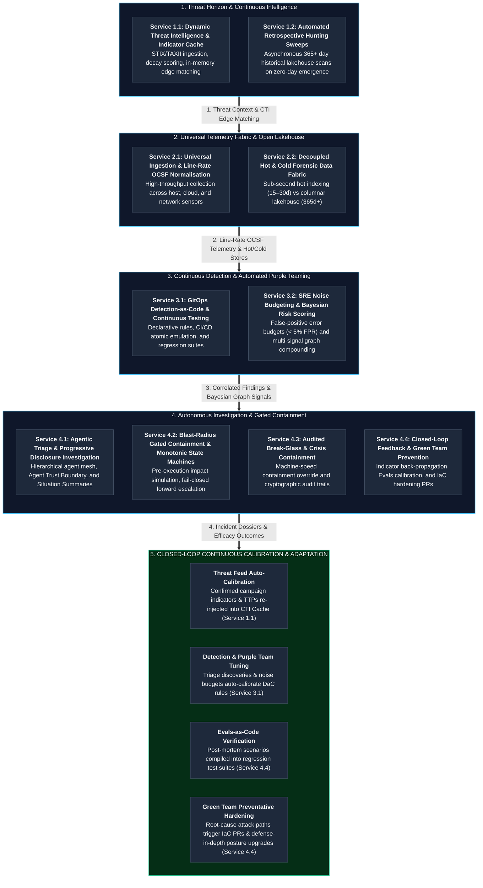

# TIDIR Macro Capabilities & Operational Services Delivery Model

Implementing the TIDIR target architecture elevates enterprise security operations from a fragmented, tool-centric cost centre into a **high-throughput, closed-loop software and reliability engineering discipline**. 

While the [Capability Model](/architecture/02-capability-model) specifies twenty-nine operational capabilities and seven AI governance disciplines, enterprise stakeholders require a consumable operational service catalogue. This document synthesises TIDIR's technical specifications into **four macro capabilities** delivering **ten core operational services** to the enterprise.

---

## 1. Enterprise Service Architecture & Value Stream

The diagram below illustrates the end-to-end service delivery lifecycle—from external threat intelligence ingestion to closed-loop engineering adaptation:

---

## 2. Detailed Service Catalogue

> [!NOTE]
> **Reference Target SLOs vs. Mandatory Conformance Criteria**:
> Operational metrics listed under each service (e.g. $\lt 15\text{ min}$ retro-hunt, $\lt 2\text{s}$ P95 search) represent **Reference Target Service Level Objectives (SLOs)** evaluated against standard reference baselines (e.g. 100 TB lakehouse tiers), not absolute universal conformance criteria.

### Macro Capability 1: Threat Horizon & Continuous Intelligence Management
Transforms raw threat data from passive reference lists into an active, machine-speed driver of detection and proactive hunting.

#### Service 1.1: Dynamic Threat Intelligence & Indicator Cache
* **Description:** Continuous ingestion, normalisation, and automated confidence-decay scoring of external attacker tradecraft, indicators, and attack flows—caching high-fidelity threat observables into sub-millisecond memory for line-rate matching.
* **Customer Value:** Replaces static indicator lists with living, temporal intelligence; protects against indicator pollution via automated half-life decay.
* **Operational SLAs:** Ingestion-to-cache latency $\lt 30\,\text{seconds}$; constant-time $O(1)$ stream lookups.
* **Underpinning Capabilities:** `CTI-01`, `CTI-02`, `CTI-04`.

#### Service 1.2: Automated Retrospective Hunting Sweeps
* **Description:** Whenever a zero-day exploit or high-severity threat campaign emerges, the platform automatically sweeps historical telemetry across 365+ days of lakehouse storage, answering *"were we compromised before this was public?"* within minutes.
* **Customer Value:** Eliminates the historical blind spot; provides verifiable answers to board and regulatory enquiries regarding newly disclosed vulnerabilities.
* **Operational SLAs:** 90-day forensic sweep completed in $\lt 15\,\text{minutes}$; 365-day petabyte sweep completed in $\lt 60\,\text{minutes}$.
* **Underpinning Capabilities:** `CTI-05`, `DATA-05`.

---

### Macro Capability 2: Universal Telemetry Fabric & Open Lakehouse Analytics
Eliminates proprietary data silos and per-gigabyte licensing penalties, providing an open, searchable data foundation for the entire enterprise.

#### Service 2.1: Universal Ingestion & Line-Rate OCSF Normalisation
* **Description:** High-throughput collection across host sensors, cloud audit planes, identity providers, and network boundaries—compiling raw payloads into the Open Cybersecurity Schema Framework (OCSF) at line rate.
* **Customer Value:** Decouples detection logic from proprietary vendor log formats; designed to prevent telemetry loss via automated Dead-Letter Queue (DLQ) quarantine envelopes and local edge spooling failover.
* **Operational SLAs:** Line-rate normalisation latency $\lt 5\,\text{ms}$ per event; sustained throughput $\ge 500\text{k EPS}$.
* **Underpinning Capabilities:** `DATA-01`, `DATA-02`, `DATA-03`.

#### Service 2.2: Decoupled Hot & Cold Forensic Data Fabric
* **Description:** Dual-tier storage management that routes immediate operational telemetry into sub-second hot indices (15–30 days) while streaming complete forensic histories into cost-effective columnar lakehouses (Parquet)—retaining full evidentiary fidelity without artificial edge filtering.
* **Customer Value:** Reduces infrastructure and licensing costs by $\ge 70\%$ compared to legacy centralized indexing; ensures full multi-year compliance auditability.
* **Operational SLAs:** Hot tier P95 search latency $\lt 2\,\text{seconds}$; Lakehouse data availability $\lt 5\,\text{minutes}$ from emission.
* **Underpinning Capabilities:** `DATA-04`, `DATA-05`.

---

### Macro Capability 3: Continuous Detection Engineering & Automated Purple Teaming
Replaces manual rule writing with modern software engineering disciplines, continuous testing, and mathematically grounded alert synthesis.

#### Service 3.1: GitOps Detection-as-Code (DaC) & Continuous Testing
* **Description:** Detection rules are treated as software: authored in Polyglot Detection-as-Code ([ADR-0019](../adr/0019-polyglot-detection-as-code-and-native-engine-adaptation.md)) combining vendor-neutral YAML metadata envelopes with target-optimized query blocks (KQL, SPL, SQL), versioned in Git, and continuously regression-tested in CI/CD against atomic attack simulations before reaching production.
* **Customer Value:** Prevents rule rot; guarantees detection coverage against evolving attacker tradecraft; eliminates syntax and logic errors in production.
* **Operational SLAs:** 100% pass rate in CI/CD synthetic test suites; rule deployment cycle $\lt 10\,\text{minutes}$ from merge.
* **Underpinning Capabilities:** `DET-01`, `DET-02`, `DET-03`.

#### Service 3.2: SRE Noise Budgeting & Bayesian Risk Scoring
* **Description:** Enforces Site Reliability Engineering (SRE) Alert Noise Error Budgets (false-positive rate $\le 5\%$) to prevent analyst burnout. Treats single anomalies as weak graph signals, elevating incidents only after Bayesian multi-signal compounding confirms anomalous behaviour across assets, identities, and network flows.
* **Customer Value:** Mitigates the operational consequences of the Base Rate Fallacy / False Positive Paradox via dependency-aware evidence aggregation; reduces alert fatigue; ensures analysts investigate only high-probability, actionable findings.
* **Operational SLAs:** Alert False Positive Rate $\le 5\%$ rolling 30-day per rule class; automated deployment freezes triggered when noise budget is exhausted.
* **Underpinning Capabilities:** `DET-04`, `DET-05`, `DET-06`.

---

### Macro Capability 4: Autonomous Investigation & Blast-Radius-Gated Containment
Compresses investigation and containment timelines from hours to seconds while maintaining deterministic safety rails and human oversight.

#### Service 4.1: Agentic Triage & Progressive Disclosure Investigation
* **Description:** Hierarchical autonomous agents (behind dual-plane Agent Trust Boundaries) assemble complete 90-day baselines, process lineages, and identity graphs upon alert trigger—presenting analysts with a concise Situation Summary rather than raw alert floods.
* **Customer Value:** Reduces Mean Time to Investigate (MTTI) from hours to under 60 seconds; eliminates pivot fatigue; ensures zero hallucinated containment recommendations via deterministic invariant validation and advisory Proposer/Challenger critique.
* **Operational SLAs:** Automated case dossier hydration $\lt 60\,\text{seconds}$; Proposer/Challenger agreement rate $\gt 80\%$.
* **Underpinning Capabilities:** `INV-01`, `INV-02`, `INV-03`, `INV-05`, `INV-06`.

#### Service 4.2: Blast-Radius Gated Containment & Monotonic State Machines
* **Description:** Automated containment workflows structured as declarative, monotonic state machines. Low-risk actions execute autonomously within seconds; disruptive actions (e.g. host isolation) evaluate active network sessions and service criticality before presenting pre-computed impact cards to human commanders. On partial failure, perimeters freeze in place and escalate forward rather than rolling back.
* **Customer Value:** Rapid containment of lateral movement; prevents self-inflicted business outages; eliminates the vulnerability of rollback sequences reopening compromised perimeters.
* **Operational SLAs:** Automated Tier 1 containment $\lt 15\,\text{seconds}$; 100% fail-closed boundary enforcement.
* **Underpinning Capabilities:** `RESP-01`, `RESP-02`, `RESP-03`.

#### Service 4.3: Audited Break-Glass & Crisis Containment
* **Description:** Provides an authenticated, emergency override protocol for machine-speed attacks (e.g. automated ransomware outbreaks), paired with cryptographically sealed, tamper-evident evidence lockers satisfying court and regulatory standards.
* **Customer Value:** Halts machine-speed adversary propagation before data exfiltration occurs; provides legally defensible non-repudiation audit trails for regulators and cyber insurance underwriters.
* **Operational SLAs:** Emergency break-glass execution $\lt 5\,\text{minutes}$; audit broadcast latency $\lt 5\,\text{seconds}$; RFC 3161 cryptographic verification $100\%$.
* **Underpinning Capabilities:** `INV-04`, `RESP-04`.

#### Service 4.4: Closed-Loop Engineering Feedback & Green Team Prevention
* **Description:** Every confirmed incident automatically feeds indicators back into intelligence stores, calibrates detection models, updates agent evaluation suites (Evals-as-Code), and synthesises actionable Infrastructure-as-Code (IaC) hardening pull requests for Green Teams (Platform / Cloud Engineering) to eliminate root causes.
* **Customer Value:** Closes the loop between reactive response and proactive defense-in-depth; ensures the enterprise never falls victim to the same threat campaign twice while systematically shrinking the attack surface.
* **Operational SLAs:** Feedback loops dispatched automatically upon incident closure; prompt eval suites executed within CI/CD pull requests; Green Team hardening PRs staged within $\lt 1\,\text{hour}$.
* **Underpinning Capabilities:** `RESP-05`, `AIGOV-01`, `AIGOV-02`.

---

## 3. Target Outcome & Validation Hypotheses Matrix

The matrix below operationalises the enterprise outcomes, architectural hypotheses, validation metrics, and demonstration maturity states across the TIDIR service architecture:

| Macro Capability | Core Enterprise Target Outcome | Target Validation Hypothesis | Validation Metric & Service Level | Validation State |
| :--- | :--- | :--- | :--- | :--- |
| **1. Threat Horizon & Intelligence** | Proactive posture adaptation; exposure quantification during zero-day crises. | **Hypothesis:** Continuous STIX/TAXII indicator decay and automated retro-hunting reduce time-to-assess enterprise exposure from days to under 15 minutes. | Retrospective sweep completion $\lt 15\,\text{min}$; Indicator cache lookup $\lt 5\,\text{ms}$ | `Pilot Validated` |
| **2. Telemetry Fabric & Lakehouse** | Unified operational and compliance visibility; elimination of vendor storage lock-in. | **Hypothesis:** Line-rate OCSF normalisation paired with decoupled columnar lakehouse storage reduces annual telemetry licensing expenditure by $\ge 70\%$ versus proprietary index models. | Ingestion throughput $\ge 500\text{k EPS}$; Hot search latency $\lt 2\,\text{s}$ | `Lab Validated` |
| **3. Continuous Detection & Purple Teaming** | Resilient detections; predictable alert queues; elimination of analyst operational fatigue. | **Hypothesis:** Automated adversary emulation in CI/CD paired with alert noise error budgets improves detection rule lifespan and reduces triage queue noise by $\ge 75\%$. | Detection MTTD $\lt 5\,\text{s}$ (stream) / $\lt 24\,\text{h}$ (batch); Noise ratio false-positive rate $\le 5\%$ | `Lab Validated` |
| **4. Autonomous Investigation & Containment** | Machine-speed threat neutralisation; zero unintended operational outages; regulatory-grade defensibility. | **Hypothesis:** Pre-execution blast-radius simulation, multi-model consensus, and reachability-bounded forward compensation allow sub-60s containment without inducing operational downtime. | Investigation MTTI $\lt 60\,\text{s}$; Automated MTTC $\lt 15\,\text{s}$; Human MTTC $\lt 5\,\text{min}$ | `Lab Validated` |

*Validation Maturity Lifecycle:* `Unvalidated` ➔ `Lab Validated` ➔ `Pilot Validated` ➔ `Production Observed`
