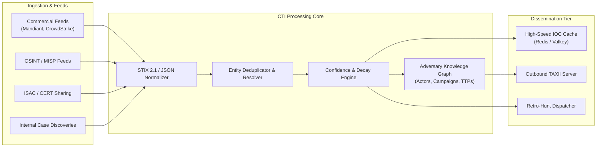

# Component Specification: Cyber Threat Intelligence (CTI)

## 1. Overview & Objectives

The Cyber Threat Intelligence (CTI) subsystem in TIDIR aggregates, curates, contextualizes, and disseminates actionable adversary intelligence. Rather than acting as a passive knowledge repository, the CTI component functions as an active participant in detection enrichment, retroactive hunting, and automated case context.

---

## 2. Core Functional Requirements

1. **Multi-Source Ingestion**:
   - Native support for STIX 2.1 over TAXII 2.1 protocol.
   - Webhook & REST API ingestion for custom threat feeds and community repositories (MISP, AlienVault OTX).
   - Internal ingestion pipeline consuming IOCs discovered during incident response investigations.

2. **Deduplication & Disambiguation**:
   - Indicator hashing and normalization (canonical domain lowercasing, IP CIDR collapse, SHA256 mapping).
   - Provenance tracking (retaining source attribution and observed timestamp per indicator).

3. **Confidence Scoring & Temporal Decay**:
   - Composite scoring algorithm based on feed reliability, corroborating sources, and indicator age.
   - Dynamic decay function:
     $$\text{Score}(t) = \text{InitialScore} \times e^{-\lambda t}$$
     where $\lambda$ varies by indicator type (e.g., dynamic IP addresses decay rapidly with high $\lambda$; actor-controlled command-and-control domains or binary hashes decay slowly).

4. **Integration Interfaces**:
   - **Streaming Detection**: Hot key-value lookup cache (Redis/Valkey) updated via change-data-capture (CDC) for sub-millisecond matching in stream detection pipelines.
   - **Retroactive Hunting**: Automated triggering of historical lakehouse scans when high-severity zero-day indicators are ingested.
   - **Analyst Investigation Workbench**: GraphQL / REST endpoints for pulling full threat actor profiles, associated campaigns, and MITRE ATT&CK techniques.

---

## 3. Data Model & Schemas

The CTI subsystem leverages the **STIX 2.1** standard:
- **Indicator**: Patterns representing observable artifacts (IPs, hashes, domains, file paths).
- **Threat Actor**: Profiles of organized cybercrime groups or state-sponsored APTs.
- **Attack Pattern**: MITRE ATT&CK techniques associated with actor behavior.
- **Relationship**: Directed edges representing `indicates`, `targets`, `uses`, and `attributed-to`.

---

## 4. Reference Technology Stack Options

| Sub-component | Open-Source Option | Cloud Native / Managed Option | Commercial Reference |
| :--- | :--- | :--- | :--- |
| **TIP Core** | OpenCTI / MISP | AWS OpenSearch + Graph DB | ThreatConnect / Recorded Future |
| **Indicator Cache** | Redis / Valkey | Amazon ElastiCache / Azure Cache | Redis Enterprise |
| **Knowledge Graph** | Neo4j Community / Memgraph | Amazon Neptune / Azure Cosmos DB | Enterprise Graph Engines |
