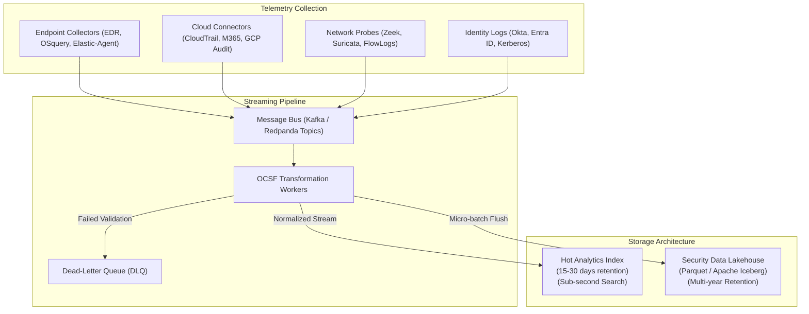

# Component Specification: Telemetry & Data Fabric

## 1. Overview & Objectives

The Telemetry & Data Fabric provides the foundational data infrastructure for TIDIR. It guarantees reliable, high-throughput ingestion from heterogeneous security data sources, real-time normalization into the Open Cybersecurity Schema Framework (OCSF), and tier-optimized storage across hot analytical indices and durable lakehouse repositories.

---

## 2. Core Functional Requirements

1. **Scalable Ingestion & Buffering**:
   - Resilient against downstream pipeline slowdowns using distributed partition logs (Kafka/Redpanda).
   - Dynamic partition autoscaling based on incoming event rates (Events Per Second - EPS).
   - At-least-once message delivery semantics with consumer deduplication.

2. **OCSF Schema Normalization**:
   - Decouple raw vendor telemetry from detection logic.
   - Mapping catalog for:
     - Host Activity (Process Creation, Network Connections, File Operations) -> OCSF System Activity / Process Activity classes.
     - Cloud Management Plane -> OCSF Cloud / Account Activity classes.
     - Network Flows -> OCSF Network Activity classes.
     - Identity / Auth Events -> OCSF Authentication / Identity classes.
   - Dead-Letter Queue (DLQ) for non-conforming or unparseable payloads with automated alerting.

3. **Dual-Tier Storage Architecture**:
   - **Hot Tier (Search & Immediate Triage)**:
     - Fast column/text indices (OpenSearch, Quickwit, ClickHouse).
     - Retains recent 15–30 days.
     - Optimized for needle-in-a-haystack lookups, timeline queries, and analyst interactive dashboards.
   - **Lakehouse Tier (Historical, Deep Analytics & ML)**:
     - Open table format (Apache Iceberg) backed by S3 / GCS / Azure Blob.
     - Columnar Parquet compression (Snappy / Zstd).
     - Partitioned by event timestamp (`dt=YYYY-MM-DD/hh=HH`) and OCSF class.
     - Queryable via distributed engines (Trino, DuckDB, AWS Athena, BigQuery).

---

## 3. Reference Technology Stack Options

| Sub-component | Open-Source Option | Cloud Native / Managed Option | Commercial Reference |
| :--- | :--- | :--- | :--- |
| **Stream Bus** | Redpanda / Apache Kafka | AWS Kinesis / Azure Event Hubs | Confluent Cloud |
| **Normalization** | Vector / Fluent Bit / Logstash | AWS Lambda / Google Cloud Dataflow | Cribl Stream |
| **Hot Analytics** | OpenSearch / Quickwit / ClickHouse | Amazon OpenSearch / Azure Monitor | Splunk / Elastic |
| **Lakehouse** | Apache Iceberg + MinIO + Trino | AWS S3 + Athena / Snowflake | Databricks / Snowflake |
