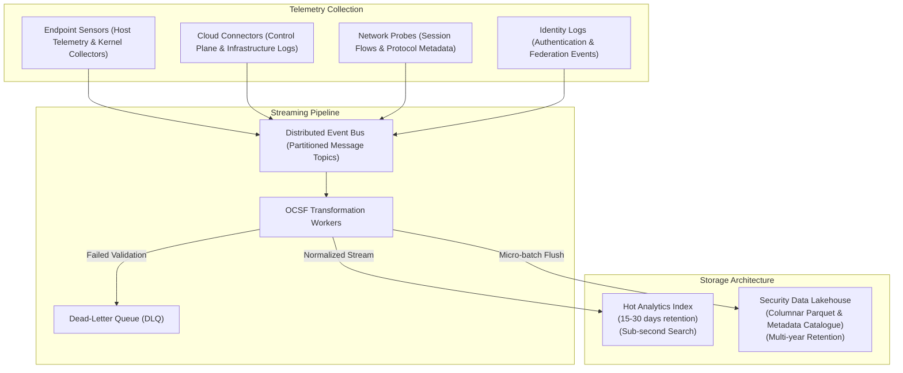

# Component Specification: Telemetry & Data Fabric

## 1. Overview & Objectives

The Telemetry & Data Fabric provides the foundational data infrastructure for TIDIR. It guarantees reliable, high-throughput ingestion from heterogeneous security data sources, real-time normalization into the Open Cybersecurity Schema Framework (OCSF), and tier-optimised storage across hot analytical indices and durable lakehouse repositories.

---

## 2. Core Functional Requirements

1. **Scalable Ingestion & Buffering**:
   - Resilient against downstream pipeline slowdowns using distributed partitioned commit logs.
   - Dynamic partition autoscaling based on incoming event rates (Events Per Second - EPS).
   - At-least-once message delivery semantics with consumer deduplication.

2. **OCSF Schema Normalization**:
   - Decouple raw vendor telemetry from detection logic.
   - Mapping catalog for:
     - Host Activity (Process Creation, Network Connections, File Operations) -> OCSF System Activity / Process Activity classes.
     - Cloud Management Plane -> OCSF Cloud / Account Activity classes.
     - Network Flows -> OCSF Network Activity classes.
     - Identity / Auth Events -> OCSF Authentication / Identity classes.
   - Dead-Letter Queue (DLQ) for non-conforming or unparseable payloads with automated alerting.

3. **Dual-Tier Storage Architecture**:
   - **Hot Tier (Search & Immediate Triage)**:
     - High-throughput inverted text and columnar indices.
     - Retains recent 15–30 days.
     - Optimised for needle-in-a-haystack lookups, timeline queries, and analyst interactive dashboards.
   - **Lakehouse Tier (Historical, Deep Analytics & ML)**:
     - Open table metadata catalogue backed by highly durable object storage.
     - Columnar Parquet compression (Snappy / Zstd).
     - Partitioned by event timestamp (`dt=YYYY-MM-DD/hh=HH`) and OCSF class.
     - Queryable via distributed SQL execution engines.

---

## 3. Architectural Capability Archetypes & Protocol Standards

| Subsystem Component | Functional Capability Pattern | Data Model & Protocol Standards |
| :--- | :--- | :--- |
| **Streaming Message Fabric** | Distributed partitioned append-only log with horizontal partition rebalancing and consumer offset tracking. | Binary streaming protocol; SASL/SCRAM authentication; mTLS encryption. |
| **Line-Rate Normalisation Engine** | Stateless, horizontally scalable schema translation workers compiling proprietary event formats into standard records. | Open Cybersecurity Schema Framework (OCSF v1.3+); JSON/Avro serialization. |
| **Hot Analytics Engine** | Distributed columnar and inverted search index supporting sub-second aggregations and temporal range queries. | Open search query dialect; REST/HTTP API. |
| **Columnar Lakehouse Engine** | Serverless distributed query engine operating directly against immutable columnar file stores with ACID snapshot isolation. | Open table format metadata specifications; Apache Parquet format. |
