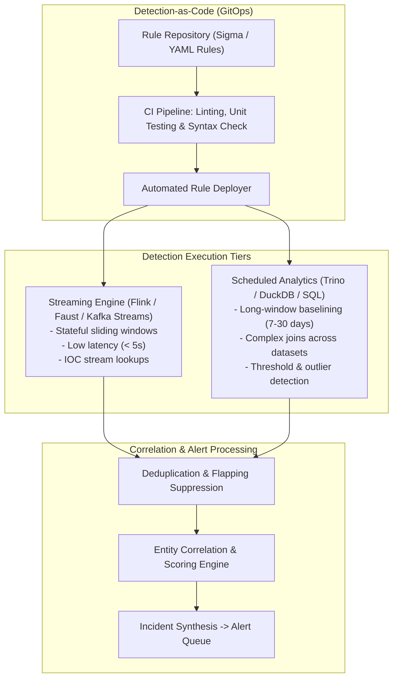

# Component Specification: Detection Engine

## 1. Overview & Objectives

The Detection Engine applies threat logic against both streaming and historical telemetry. It couples near-real-time streaming pattern recognition with scheduled analytical lakehouse queries, adopting a **Detection-as-Code (DaC)** lifecycle to ensure that detection logic is versioned, unit-tested, and maintainable.

---

## 2. Core Functional Requirements

1. **Dual Detection Paradigms**:
   - **Streaming Detection**:
     - Sub-second evaluation of incoming normalized OCSF events.
     - Sliding time-window correlations (e.g., 5 failed logins followed by a success within 2 minutes).
     - In-flight enrichment against the CTI in-memory IOC cache.
   - **Scheduled / Lakehouse Detection**:
     - Periodic SQL queries executed against Apache Iceberg data.
     - Aggregations and statistical baselines (e.g., user authenticating from a new geographic ASN not observed in the past 60 days).
     - Low-frequency, high-compute analytics unsuitable for stream processing.

2. **Detection-as-Code (DaC) Architecture**:
   - Rules maintained as code (Sigma rules or declarative YAML specifications).
   - Pre-deployment CI checks:
     - Rule syntax validation against OCSF schema.
     - Mock data unit testing (verifying true positives trigger and benign data passes).
     - Blast-radius / volume simulation against historical data to prevent alert storms.
   - Immutable version tagging and rollbacks.

3. **Alert Correlation & Entity Scoring**:
   - Deduplication engine suppressing identical alerts within a configurable quiet window.
   - Entity-centric graph correlation: links alerts sharing an entity ID (e.g., `user_id`, `hostname`, `ip_address`) within an active time window into a single compound incident.
   - Dynamic Risk Scoring: composite score evaluating alert severity, asset criticality (e.g., Domain Controller vs. Dev VM), and user threat tier.

---

## 3. Reference Technology Stack Options

| Sub-component | Open-Source Option | Cloud Native / Managed Option | Commercial Reference |
| :--- | :--- | :--- | :--- |
| **Stream Detection** | Apache Flink / Faust / Arroyo | AWS Managed Service for Apache Flink | Panther / Sumo Logic |
| **Scheduled Analytics** | Trino / DuckDB / ClickHouse | AWS Athena / Snowflake Scheduled Tasks | Snowflake / Databricks |
| **Rule Standard** | Sigma / OCSF Detection Rules | Cloud-native rule templates | Splunk SPL / Elastic KQL |
| **CI/CD Testing** | GitHub Actions + synthetic OCSF runner | GitLab CI / AWS CodePipeline | Native DaC platforms |
