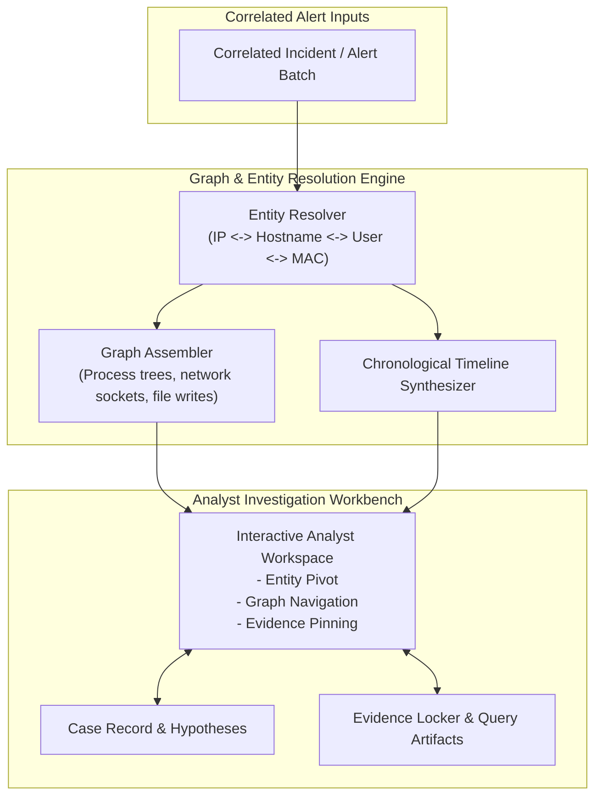

# Component Specification: Investigation & Case Management

## 1. Overview & Objectives

The Investigation & Case Management subsystem empowers security analysts and incident responders to rapidly triage, scope, and document security incidents. It combines automated entity resolution, process and network graph visualization, unified chronological timeline reconstruction, and tamper-evident case evidence tracking.

---

## 2. Core Functional Requirements

1. **Entity Resolution**:
   - Maintains temporal entity mappings (e.g. mapping an ephemeral DHCP IP address at timestamp $T$ to a specific device hostname, user login session, and MAC address).
   - Unified entity 360-view: clicking an entity displays all active sessions, recent alerts, baseline activity, and associated assets.

2. **Interactive Graph Exploration & Timeline Reconstruction**:
   - **Process Execution Trees**: Visual representation of parent-child process chains (e.g. `winword.exe` -> `powershell.exe` -> `certutil.exe`).
   - **Network & Identity Graphs**: Bipartite and multi-modal graph rendering linking hosts, internal lateral movement connections, external C2 endpoints, and authenticated credentials.
   - **Master Timeline**: Chronological event ordering across heterogeneous log streams, synchronized to millisecond-precision UTC.

3. **Case Management & Evidence Tracking**:
   - Structured incident lifecycle tracking (New, Triaging, Contained, Eradicated, Closed).
   - Evidence Locker: Stores raw query snapshots, file hashes, PCAP extracts, and analyst annotations with immutable cryptographic checksums.
   - Automated Summary & Dossier: Produces standardized executive and technical incident debriefs for post-incident review (PIR).

---

## 3. Reference Technology Stack Options

| Sub-component | Open-Source Option | Cloud Native / Managed Option | Commercial Reference |
| :--- | :--- | :--- | :--- |
| **Case Management** | TheHive / Cortex | AWS Systems Manager Incident Manager | ServiceNow SecOps / Jira Service Mgmt |
| **Graph Visualization** | Cytoscape.js / D3 / Neo4j | Amazon Neptune Graph Notebooks | Linkurious / Maltego |
| **Evidence Store** | MinIO + PostgreSQL | Amazon S3 + DynamoDB / Aurora | Proprietary SOAR/SIEM backends |
| **Analyst UI** | Kibana / OpenSearch Dashboards | Managed Grafana / Custom Next.js app | Chronicle / Microsoft Sentinel |
