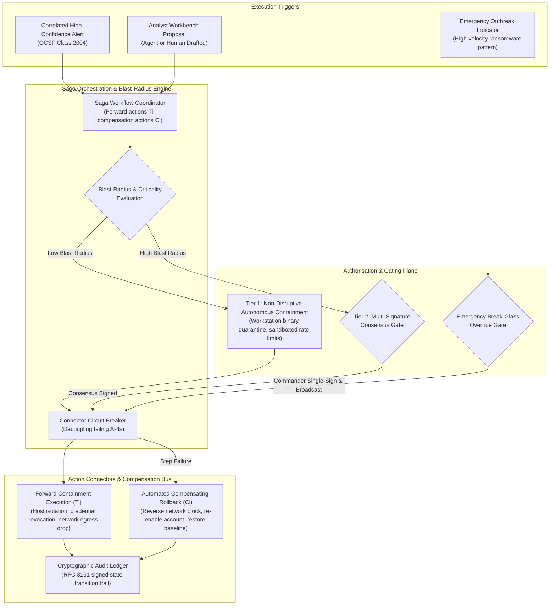

# Component Specification: Automated Response & Containment

## 1. Overview & Objectives

The Automated Response & Containment capability executes codified playbooks to accelerate incident triage, enrich investigations, and contain active security threats. To protect business operations while achieving high containment velocity, the architecture enforces a **Blast-Radius Risk Tiering** model that cleanly separates automated, low-risk operational steps from disruptive actions requiring human-in-the-loop authorisation.

---

## 2. Core Functional Requirements

1. **Saga Orchestration & Compensating State Machine**:
   - Multi-step containment and mitigation workflows are executed as distributed **Sagas** to eliminate orphaned or half-contained states.
   - For every mutating forward action ($T_i$, e.g. isolate endpoint network interface), the playbook explicitly defines a tested compensating action ($C_i$, e.g. re-enable network interface).
   - If any downstream API fails during a containment sequence after exponential retries are exhausted, the orchestrator halts forward progress and executes compensating actions in reverse topological order ($C_{i-1}, \dots, C_1$), safely restoring the enterprise environment to a deterministic baseline state.

2. **Blast-Radius Risk Tiering & Emergency Protocols**:
   - **Tier 0 (Passive Enrichment & Querying)**:
     - Fully autonomous execution.
     - Actions: Reverse DNS, external threat reputation queries, asset dependency tree lookups, directory metadata extraction.
   - **Tier 1 (Targeted Low-Disruption Containment)**:
     - Autonomous execution for verified high-confidence detections on non-critical assets (e.g. standard user endpoints).
     - Actions: Quarantining an untrusted binary, terminating an isolated user-space process, adding an external IP to a temporary ingress throttle list.
   - **Tier 2 (High-Impact / Disruptive Operations)**:
     - Enforces dual-authorisation consensus (Incident Commander + Asset Owner / SecOps Lead).
     - Actions: Isolating production database hosts or domain controllers, enterprise-wide session token invalidation, perimeter BGP or boundary firewall route modifications.
   - **Emergency Break-Glass Protocol**:
     - For catastrophic, high-velocity outbreaks (e.g. active automated ransomware propagation across multiple subnets), an authenticated on-duty Incident Commander can activate a **Break-Glass Override**.
     - Bypasses multi-signature queues for pre-compiled critical containment playbooks.
     - Emits instantaneous out-of-band cryptographic audit notifications to executive communication channels and permanently commits the action with non-repudiation metadata to the evidence ledger.

3. **Connector Resilience & Circuit Breaking**:
   - Downstream integration connectors enforce strict rate limits, exponential backoff, and stateful circuit breakers.
   - If a third-party control plane experiences elevated error rates ($> 5\%$ 5xx responses or timeouts), the connector trips open, diverting automated actions to an operator escalation queue rather than stalling the pipeline.

4. **Closed-Loop Intelligence & DaC Feedback**:
   - Upon incident containment and resolution:
     - Verified indicators (hashes, C2 domains) are exported directly into the Layer 1/3 Threat Intelligence fabric.
     - Case outcome classifications (True Positive vs. Benign Baseline) trigger automated rule tuning pull requests in the Detection-as-Code repository.

---

## 3. Architectural Patterns & Capability Archetypes

| Subsystem Component | Functional Architecture Pattern | Data Model & Protocol Standards |
| :--- | :--- | :--- |
| **Saga Orchestrator** | Distributed state machine with forward recovery, backward compensation, and idempotent retry semantics. | Declarative workflow DAG (JSON/YAML specification); stateful execution tokens. |
| **Connector Integration Bus** | Asynchronous message bus with circuit breaker patterns, backpressure management, and dead-letter routing. | CloudEvents specification; REST/gRPC bi-directional streaming interfaces. |
| **Consensus & Gating Engine** | Cryptographic multi-signature consensus workflow with timeout escalations and webhook-based interactive authorisation. | Public key signatures; out-of-band push notifications with ephemeral verification tokens. |
| **Execution Audit Ledger** | Append-only event stream with tamper-evident cryptographic sealing for every forward and compensating mutation. | RFC 3161 timestamps; immutable signed transaction log. |
