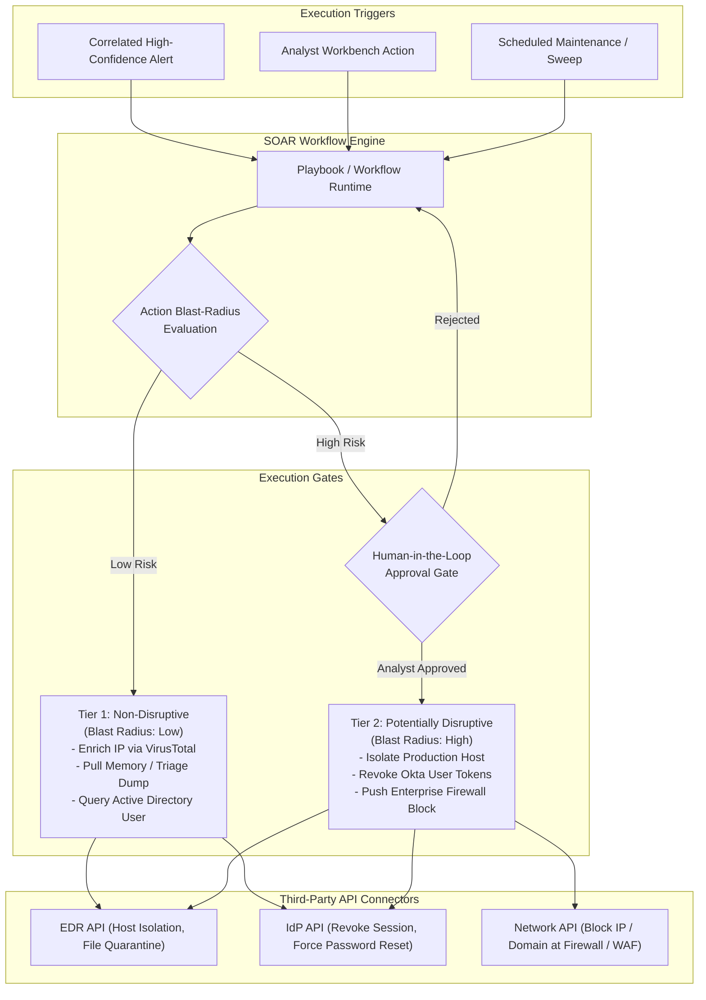

# Component Specification: Response & Automation (SOAR)

## 1. Overview & Objectives

The Response & Automation (SOAR) component executes codified playbooks to accelerate incident triage, enrich investigations, and contain active security threats. To protect business operations while achieving high containment velocity, the architecture enforces a **Blast-Radius Risk Tiering** model that cleanly separates automated, low-risk operational steps from disruptive actions requiring human-in-the-loop authorization.

---

## 2. Core Functional Requirements

1. **Declarative Playbook Engine**:
   - Code-as-configuration playbooks (JSON/YAML or TypeScript/Python workflows).
   - Stateful execution with support for branching, error handling, retries, and compensation/rollback steps.
   - Comprehensive audit logging of every step and API payload.

2. **Blast-Radius Risk Classification**:
   - **Tier 0 (Read-Only / Enrichment)**:
     - Automated execution without approval.
     - Actions: Reverse DNS, WHOIS lookups, VirusTotal / ThreatConnect queries, querying directory attributes.
   - **Tier 1 (Targeted Low-Disruption Containment)**:
     - Automated execution for high-confidence detections on non-critical assets (or pre-approved development environments).
     - Actions: Quarantining an untrusted binary hash on a single workstation, adding an IP to a temporary rate-limiting list.
   - **Tier 2 (High-Impact / Disruptive Operations)**:
     - Enforces human-in-the-loop authorization.
     - Actions: Network isolation of a production server, tenant-wide account lockout, resetting administrator passwords, modifying perimeter BGP or global firewall rules.

3. **Interactive Human-in-the-Loop Authorization**:
   - Webhook integrations with SecOps collaboration tools (Slack, Microsoft Teams, PagerDuty, Web UI).
   - Rich interactive cards showing incident summary, targeted asset, blast-radius assessment, and "Approve" / "Reject" controls with reason entry.
   - Timeouts and escalation paths if no authorization is received within SLA.

4. **Closed-Loop Intelligence & Detection Feedback**:
   - Upon incident containment and resolution:
     - Automatically exports validated IOCs (hashes, C2 domains) to the CTI platform.
     - Flags true positive vs. false positive metrics back to the Detection-as-Code registry for threshold calibration.

---

## 3. Reference Technology Stack Options

| Sub-component | Open-Source Option | Cloud Native / Managed Option | Commercial Reference |
| :--- | :--- | :--- | :--- |
| **Playbook Engine** | Shuffle / Temporal / Node-RED | AWS Step Functions / Azure Logic Apps | Palo Alto Cortex XSOAR / Splunk SOAR |
| **Integration Bus** | Kafka / NATS / RabbitMQ | Amazon EventBridge / Google Cloud Pub/Sub | Tines / Torq |
| **Approval Gateways** | Slack Bolt SDK / Teams Webhooks | AWS SNS + API Gateway + Slack Bot | Tines Interactive Pages |
