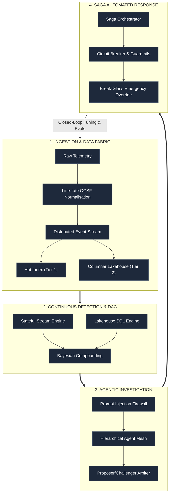

## Architectural Mission & Scope

Modern security operations face an asymmetric challenge: attackers operate at machine velocity with automated, multi-stage attack chains, whilst defenders struggle against proprietary silos, alert fatigue, and prohibitive telemetry licensing costs. 

**TIDIR** (Threat Intelligence, Detection, Investigation & Response) provides a vendor-neutral, capability-driven target technology component architecture. It synthesises modern software reliability engineering, continuous purple teaming, and secure agentic AI into an integrated, closed-loop defence ecosystem.

---

## The 3-Tier Architecture Framework

To balance executive clarity with engineering precision, TIDIR is organised across three distinct architectural tiers:

| Tier | Focus | Key Deliverables & Documents | Target Audience |
| :--- | :--- | :--- | :--- |
| **Tier 1: Strategic Architecture** | System topology, high-level components, and the closed-loop operating paradigm. | [01. System Overview](/architecture/01-system-overview), [Cross-Cutting Disciplines](/architecture/05-cross-cutting-engineering-disciplines) | CISOs, Heads of SecOps, Lead Enterprise Architects |
| **Tier 2: Capabilities & Taxonomy** | Functional capability matrix, enterprise service catalogue, MTTx service levels, and error budgets. | [02. Capability Model](/architecture/02-capability-model), [10. Macro Capabilities & Services](/architecture/10-macro-capabilities-and-services), [User Stories](/architecture/08-user-stories) | Security Managers, Detection Engineering Leads, SOC Managers |
| **Tier 3: Technical Specifications** | Concrete data schemas, pipeline protocols, state machines, and ADRs. | [Component Deep Dives](/architecture/components/01-threat-intelligence), [ADR Registry](/adr/0001-record-architecture-decisions) | Detection Engineers, Security Automation Engineers, SecOps Architects |

---

## Core Architectural Paradigms

### 1. Decoupled Lakehouse vs Restrictive Ingestion
TIDIR strictly rejects artificial "output-driven" ingestion where logs are discarded at collection time if they do not match an existing detection rule. Filtering telemetry at the edge blinds security teams to zero-day discoveries and invalidates retrospective threat hunting. Instead, TIDIR establishes a **two-tier decoupled data fabric**:
* **Hot Index (Tier 1):** High-value, immediate-retrieval telemetry retained for active operational windows (15–30 days).
* **Columnar Lakehouse (Tier 2):** Cost-effective, open-format columnar storage (Parquet/metadata catalogue) for complete historical audit retention and petabyte-scale SQL analytics.

### 2. Neutralising the Base Rate Fallacy with Bayesian Compounding
When processing billions of daily events, even detections with a 99.9% accuracy rate produce thousands of false alarms because malicious actions are rare events (the *False Positive Paradox*). TIDIR solves this by treating single-point anomalies as **weak graph signals** rather than standalone alerts. Detections are only elevated to an active incident once Bayesian compounding correlates multiple independent signals:
$$
\text{Compounded Risk} = f(\text{Telemetry Anomaly}, \text{Asset Criticality}, \text{Identity Privilege}, \text{Network Egress})
$$

### 3. Continuous Purple Teaming & SecOps Error Budgets
Borrowing from Site Reliability Engineering (SRE), detection quality is enforced through quantifiable **Alert Noise Error Budgets** (target: false positive rate $< 5\%$). Detection-as-Code (DaC) repositories execute continuous atomic attack emulation in CI/CD pipelines. If a detection rule exhausts its noise budget in production, an automated deployment freeze prevents new rule promotions until the noisy rule is tuned or deprecated.

### 4. Dual-Plane Defensive AI Runtime & Prompt Injection Firewall
Autonomous agentic workflows operate within a strictly isolated runtime:
* **Control Plane vs. Data Plane Separation:** Untrusted external telemetry (email bodies, web payloads, obfuscated command strings) is strictly compartmentalised as raw data and never injected directly into agent execution prompts.
* **Deterministic Guardrails & Multi-Model Arbitration:** High-consequence triage decisions require consensus between a *Proposer Model* (investigation specialist) and an independent *Challenger Model* (adversarial auditor) to eliminate hallucinated response actions.

### 5. Saga Pattern Automated Containment & Break-Glass Governance
Automated response actions follow the **Saga Pattern**, executing sequential compensating transactions if an action fails halfway. Containment workflows feature automated circuit breakers to protect against runaway automation. High-risk actions (such as revoking enterprise credentials or isolating mission-critical domain controllers) enforce strict **Break-Glass Human-in-the-Loop** verification gates with a maximum response latency (MTTC $< 5$ minutes).

---

## Document Navigation Matrix

Explore the complete architecture and engineering specifications across the platform:

| Section | Description | Direct Links |
| :--- | :--- | :--- |
| **System Overview** | High-level topology, interaction flows, and operating principles. | [System Architecture](/architecture/01-system-overview) · [Target Threat Model](/architecture/09-threat-model) |
| **Capability Model** | 25+ atomic capabilities, 4 macro capabilities & 10 enterprise operational services. | [Capability Matrix](/architecture/02-capability-model) · [Macro Capabilities & Services](/architecture/10-macro-capabilities-and-services) |
| **Layer Specifications** | Detailed layer-by-layer architectural contracts and data pipelines. | [L1: Data Sources](/architecture/03-layer-1-data-sources) · [L2: Pipeline & Storage](/architecture/04-layer-2-pipeline-storage-query) · [L3: Threat Intel & Detection](/architecture/06-layer-3-threat-intel-detection) · [L4: Incident Response](/architecture/07-layer-4-incident-response) |
| **Component Deep Dives** | Deep technical specifications for each functional subsystem. | [Threat Intelligence](/architecture/components/01-threat-intelligence) · [Data Fabric](/architecture/components/02-data-fabric-telemetry) · [Detection Engine](/architecture/components/03-detection-engine) · [Investigation & Cases](/architecture/components/04-investigation-cases) · [Response & Automation](/architecture/components/05-response-automation) · [AI & Agent Orchestration](/architecture/components/06-ai-orchestration) |
| **Engineering Disciplines** | Cross-cutting disciplines: SRE budgets, Purple Teaming, DaC & Evals. | [Engineering Disciplines](/architecture/05-cross-cutting-engineering-disciplines) |
| **Operational Scenarios** | End-to-end user stories and automated response workflows. | [User Stories & Scenarios](/architecture/08-user-stories) |
| **Architectural Decisions** | Formal Architectural Decision Records (ADRs 0001–0014) in MADR format. | [ADR Index](/adr/0001-record-architecture-decisions) · [ADR-0004 (Prompt Firewall)](/adr/0004-defensive-ai-runtime-and-prompt-injection-firewall) · [ADR-0005 (Saga Containment)](/adr/0005-saga-pattern-containment-and-break-glass-protocol) · [ADR-0009 (Bayesian Scoring)](/adr/0009-bayesian-multi-signal-risk-scoring) · [ADR-0010 (SABSA Alignment)](/adr/0010-sabsa-business-architecture-and-attribute-profiling) · [ADR-0011 (Entity-Finding Graph)](/adr/0011-bipartite-entity-finding-graph-consolidation) · [ADR-0012 (AI Orchestration)](/adr/0012-ai-orchestration-runtime-mcp-and-mvp-roadmap) · [ADR-0013 (Ambient Deception)](/adr/0013-ambient-deception-fabric-and-canary-anchors) |

---

## 🌐 Open Source & Community

TIDIR is hosted as an open-source research initiative under the **Apache 2.0 License**:

- 💻 **GitHub Project**: [github.com/Haribu/TIDIR](https://github.com/Haribu/TIDIR)
- 🤝 **Contribute**: Check out the [Contribution Guide](https://github.com/Haribu/TIDIR/blob/main/CONTRIBUTING.md) to propose RFCs or component additions.
- 🐛 **Issues & Feedback**: Report broken diagrams, links, or architectural proposals on [GitHub Issues](https://github.com/Haribu/TIDIR/issues).
- 🛡️ **Security Advisories**: Report vulnerabilities privately via [GitHub Security Advisories](https://github.com/Haribu/TIDIR/security/advisories) or directly to `info@harrymclaren.co.uk`.

