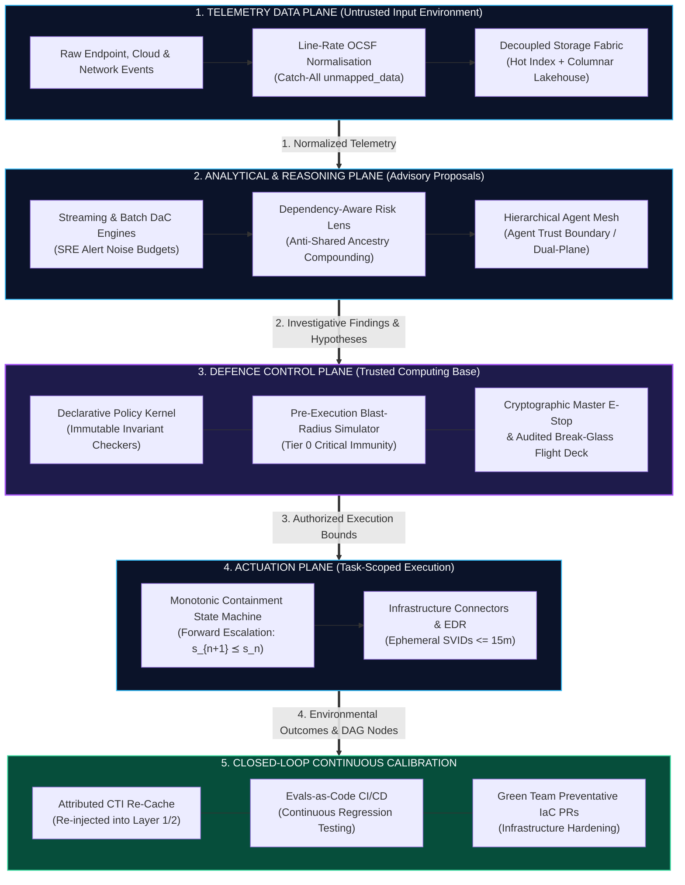
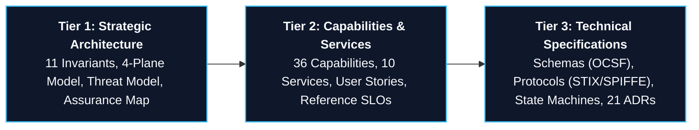

## 1. The Architecture at a Glance

TIDIR governs the operational progression from raw environmental observation to automated mitigation within a strict closed loop:

*The closed loop is completed as operational outcomes and incident graph nodes from Actuation (4) enter Continuous Calibration (5), which continuously re-keys threat caches, tunes detection noise budgets, and issues automated hardening pull requests back into the Telemetry Data Plane (1).*

---

## 2. Why TIDIR Exists: The Asymmetric Deficit in SecOps

Modern security operations are constrained by three structural failure modes:
1. **The Ingestion Dilemma**: Traditional SIEMs force teams to discard security telemetry at the collection boundary due to volume-based licensing penalties, blinding organizations during zero-day retrospectives.
2. **The Base Rate Fallacy**: In an enterprise generating $10^9$ daily events, even detections with $99.9\%$ accuracy generate thousands of false alarms, causing catastrophic analyst burnout.
3. **The Unchecked Automation Hazard**: SOAR playbooks that rely on fragile rollback scripts risk reopening compromised perimeters upon partial network failure, while unchecked LLM agents risk prompt injection attacks escalating into unauthorized infrastructure mutations.

**TIDIR solves this by decoupling the architecture into four distinct planes**—enveloping an expansive, untrusted analytical ecosystem within an ultra-lean, deterministic defence control plane.

---

## 3. The Core Architectural Thesis

TIDIR is founded upon seven non-negotiable architectural ideas:

| Architectural Principle | What It Means | Why It Matters |
| :--- | :--- | :--- |
| **Confidence $\neq$ Authority** | Epistemic likelihood ($99.9\%$ confidence) confers **zero** operational authority to isolate hosts or sever connections. | Eliminates self-granting authority; all mutations require independent policy validation. |
| **Evidence Provenance** | Every consequential finding and hypothesis must cite immutable raw observation IDs (`source_observation_ids`). | Prevents floating or ungrounded machine hallucinations from driving incident triage. |
| **Evidential Independence** | Correlated detections sharing common upstream ancestry cannot masquerade as independent corroboration. | Mathematically discounts co-derived signals to resolve the Base Rate Fallacy. |
| **Bounded Probabilistic Reasoning** | Autonomous agents operate strictly in read-only mode behind the **Agent Trust Boundary**. | Assumes prompt injection is permanent; prevents adversarial telemetry from becoming execution authority. |
| **Security-State Monotonicity** | Partial containment failure cannot increase attacker reachability ($s_{n+1} \preceq s_n$). | Replaces fragile transaction rollbacks with forward perimeter escalation. |
| **Graceful Degradation** | Failure of an advanced capability reduces sophistication, never total visibility. | Automatically falls back to edge spooling, scheduled batch lakehouse sweeps, and Zero-AI timelines. |
| **Human Recoverability** | Control planes always preserve out-of-band manual flight decks. | Retains permanent human command via cryptographic master kill-switches. |

---

## 4. The 3-Tier Architectural Model

To serve executive leaders, enterprise architects, and engineering practitioners simultaneously, TIDIR organizes its specifications across three increasing levels of technical specificity:

* **[Tier 1: Strategic Architecture](/architecture/00-architectural-invariants)**: System topology, the 11 constitutional invariants, and the formal threat model. Target audience: CISOs, Heads of SecOps, Lead Enterprise Architects.
* **[Tier 2: Capabilities & Taxonomy](/architecture/02-capability-model)**: Functional capability taxonomy, enterprise service catalogue, and operational user stories. Target audience: Security Managers, Detection Leads, SecOps SREs.
* **[Tier 3: Technical Specifications](/architecture/components/01-threat-intelligence)**: Concrete data schemas (OCSF), workload identity contracts (SPIFFE), monotonic state machines, and the [ADR Registry](/adr/). Target audience: Detection Engineers, Automation Engineers, SecOps Architects.

---

## 5. Explore by Role & Architectural Intent

Select an entry point tailored to your focus:

<h3 style="margin-top: 0; color: #38bdf8;">👔 Security Leaders (CISO / SecOps Heads)</h3>

Understand the strategic business defensibility, operational cost reduction, and executive risk governance of TIDIR.

<ul style="padding-left: 1.25rem; font-size: 0.9rem;">
  <li><a href="/guide/what-is-tidir">What is TIDIR? (Executive Summary)</a></li>
  <li><a href="/architecture/10-macro-capabilities-and-services">Enterprise Service Delivery Model</a></li>
  <li><a href="/architecture/00-architectural-invariants">The Architectural Constitution</a></li>
</ul>

<h3 style="margin-top: 0; color: #a855f7;">📐 Enterprise Security Architects</h3>

Examine the 4-plane control model, trusted computing base boundaries, and vendor-neutral open standards.

<ul style="padding-left: 1.25rem; font-size: 0.9rem;">
  <li><a href="/architecture/01-system-overview">System Overview & 4-Plane Model</a></li>
  <li><a href="/architecture/assurance-map">The Assurance Case Map</a></li>
  <li><a href="/architecture/09-threat-model">Target Architecture Threat Model</a></li>
</ul>

<h3 style="margin-top: 0; color: #34d399;">⚡ Detection & SecOps Engineers</h3>

Dive into Polyglot Detection-as-Code, SRE noise budgeting, OCSF schema normalisation, and incident playbooks.

<ul style="padding-left: 1.25rem; font-size: 0.9rem;">
  <li><a href="/architecture/02-capability-model">The 36-Capability Taxonomy</a></li>
  <li><a href="/architecture/components/03-detection-engine">Detection Engine Architecture</a></li>
  <li><a href="/adr/0019-polyglot-detection-as-code-and-native-engine-adaptation">ADR-0019: Polyglot Detection-as-Code</a></li>
</ul>

<h3 style="margin-top: 0; color: #f59e0b;">🤖 AI & Automation Researchers</h3>

Interrogate the Agent Trust Boundary, ephemeral SPIFFE SVIDs, SLM judges, and continuous Evals-as-Code.

<ul style="padding-left: 1.25rem; font-size: 0.9rem;">
  <li><a href="/architecture/components/06-ai-orchestration">AI & Agent Orchestration Plane</a></li>
  <li><a href="/adr/0004-defensive-ai-runtime-and-prompt-injection-firewall">ADR-0004: Agent Trust Boundary</a></li>
  <li><a href="/adr/0015-sandboxed-agent-execution-otlp-convergence-and-ephemeral-identity">ADR-0015: Sandboxed Agent Execution</a></li>
</ul>

---

## 6. Open Source & Machine Access

TIDIR is published as an open-source reference standard under the **Apache 2.0 License**:

* 💻 **GitHub Repository**: [github.com/Haribu/TIDIR](https://github.com/Haribu/TIDIR)
* 📡 **Machine-Readable Graph**: [`/architecture.json`](/architecture.json)
* 🤖 **AI / LLM Ingestion Summary**: [`/llms.txt`](/llms.txt)
* 📚 **Complete Single-File Corpus**: [`/llms-full.txt`](/llms-full.txt)
* 🗺️ **Sitemap**: [`/sitemap.xml`](/sitemap.xml)

